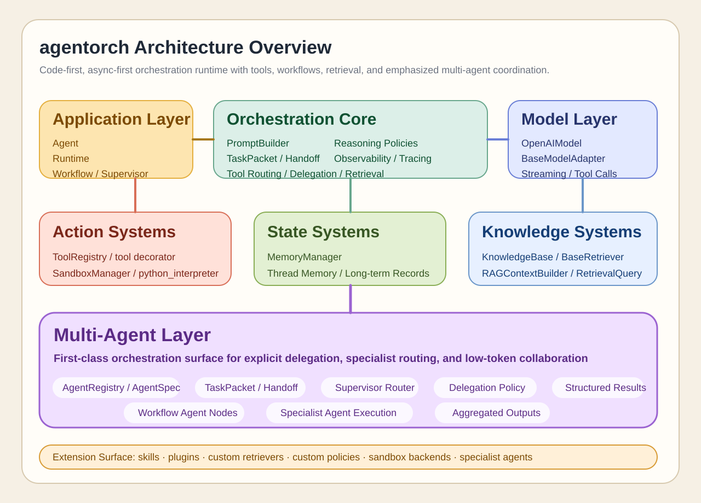

# agentorch

[中文文档 / Chinese README](README.zh-CN.md)

`agentorch` is a code-first, async-first Python agent orchestration framework for building programmable agent systems with structured tools, workflows, retrieval, memory, reasoning strategies, sandboxed execution, and multi-agent delegation.



## Why agentorch

Many agent frameworks are either too prompt-heavy, too hidden behind DSLs, or too tightly coupled to one execution pattern. `agentorch` is designed as a Python-native orchestration layer that keeps boundaries explicit and composable:

- `models` normalizes provider access
- `tools` defines structured actions
- `sandbox` isolates risky execution
- `memory` manages thread state and collective memory
- `knowledge` provides classic, deliberative, and hybrid RAG
- `reasoning` provides selectable reasoning frameworks
- `workflow` gives you Python-defined DAG orchestration
- `agents` adds registries, task packets, delegation, and supervisors
- `runtime` connects everything together

The goal is not to hide orchestration, but to make it programmable, inspectable, and extensible.

## What It Supports

- OpenAI-compatible chat model access
- Structured tool registration and tool calling
- Sandboxed Python execution with a code interpreter tool
- Thread memory, records, checkpoints, workspace artifacts, and shared notes
- MGCM-style collective memory governance for multi-agent systems
- Multi-format RAG over `pdf/docx/md/txt/code/memory/artifacts`
- Selectable RAG strategies: `classic`, `deliberative`, `hybrid`, `off`
- Report-style retrieval output with evidence, citations, coverage, and visited sources
- Reasoning frameworks: `cot`, `react`, `plan_execute`, `tot`, `reflexion`
- Python API workflow DAGs with retrieval, mount, evaluation, and agent nodes
- Multi-agent registration and supervisor-based delegation
- Evolution search with `genetic`, `random_search`, `hill_climb`, `beam_search`
- Prompt cards and LangChain-style prompt building primitives
- Tracing and usage tracking

## Recommended API Style

The current recommended API style is:

High-level entrypoints:

- `create_agent(...)`
- `create_multi_agent(...)`

Core assembly:

- `ModelConfig.from_any(...)`
- `OpenAIModel.from_config(...)`
- `RuntimeConfig.agent(...)` and `RuntimeConfig.workflow(...)`
- `RagStrategyConfig.for_classic(...)`, `for_deliberative(...)`, `for_hybrid(...)`
- `ReasoningStrategyConfig.react(...)`, `plan_execute(...)`, `reflexion(...)`
- `ToolRegistry.from_tools(...)` and `ToolRegistry.with_bundles(...)`
- `IndexedKnowledgeBase.create(...)` / `acreate(...)`
- `Runtime.create(...)` / `acreate(...)`
- `Agent.create(...)` / `acreate(...)`
- `WorkflowBuilder()` plus `Node.*(...)` shortcuts

Use the facade entrypoints for day-to-day work. Drop to `create(...)` / `acreate(...)` when you want fully manual runtime assembly.

## Installation

For local development:

```bash
pip install -e .
```

Recommended Python version:

```text
Python 3.10+
```

## Environment Setup

`agentorch` follows a standard library-style configuration boundary:

- Pass `model`, `api_key`, and `base_url` explicitly in code when you want full control.
- Use environment variables when you want deploy-time configuration.
- `.env` loading is opt-in. Call `initialize_environment(...)` yourself, or set `AGENTORCH_AUTO_LOAD_ENV=1` before importing `agentorch`.

Core environment contract:

- `OPENAI_API_KEY` / `OPENAI_BASE_URL`
- `OPENAI_VISION_MODEL`
- `OPENAI_EMBEDDING_API_KEY` / `OPENAI_EMBEDDING_BASE_URL` / `OPENAI_EMBEDDING_MODEL` / `OPENAI_EMBEDDING_DIMENSIONS`
- `OPENAI_TTS_API_KEY` / `OPENAI_TTS_BASE_URL` / `OPENAI_TTS_MODEL` / `OPENAI_TTS_VOICE` / `OPENAI_TTS_FORMAT` / `OPENAI_TTS_SPEED`
- `OPENAI_IMAGE_API_KEY` / `OPENAI_IMAGE_BASE_URL` / `OPENAI_IMAGE_EXPLICIT_URL` / `OPENAI_IMAGE_MODEL`
- `OPENAI_IMAGE_ASPECT_RATIO` / `OPENAI_IMAGE_SIZE` / `OPENAI_IMAGE_TIMEOUT`
- `OPENAI_IMAGE_FALLBACK_MODELS` / `OPENAI_IMAGE_RETRY_WITHOUT_PROXY` / `OPENAI_IMAGE_DISABLE_ENV_PROXY`
- `OPENAI_VIDEO_API_KEY` / `OPENAI_VIDEO_BASE_URL` / `OPENAI_VIDEO_MODEL` / `OPENAI_VIDEO_DISABLE_ENV_PROXY`

The core library keeps protocol-level defaults such as `/chat/completions`, `/embeddings`, `/audio/speech`, `mp3`, and `speed=1.0`. It does not choose provider gateways, models, or secrets for you.

Recommended:

```env
OPENAI_API_KEY=sk-xxxx
OPENAI_BASE_URL=https://api.openai.com/v1
OPENAI_EMBEDDING_MODEL=text-embedding-3-small
OPENAI_TTS_MODEL=your-tts-model
OPENAI_TTS_VOICE=your-voice
```

If you use an OpenAI-compatible gateway, full endpoint URLs such as `.../chat/completions`, `.../embeddings`, or `.../audio/speech` are normalized back to the required provider base URL.

## Quick Start

### 1. Minimal agent

Normal Python script:

```python
from agentorch import create_agent

agent = create_agent(
    model="gpt-4.1-mini",
    system_prompt="You are a concise and accurate assistant.",
    reasoning="react",
)

result = agent.run_sync(
    "Explain what agentorch is in three short sentences.",
    thread_id="quickstart-001",
)

print(result.output_text)
```

`create_agent(...)` is the recommended high-level entry point for single agents.
Use `Agent.create(...)` / `Runtime.create(...)` when you want full manual runtime assembly.

### 2. Structured tool calling

```python
from pydantic import BaseModel

from agentorch import ToolRegistry, create_agent, tool


class AddInput(BaseModel):
    a: int
    b: int


@tool(description="Add two integers together.")
async def add_numbers(input: AddInput):
    return {"sum": input.a + input.b}


agent = create_agent(
    model="gpt-4.1-mini",
    tools=ToolRegistry.from_tools(add_numbers),
    reasoning="react",
)

result = agent.run_sync(
    "Use the add_numbers tool to calculate 123 + 456 and explain the result.",
    thread_id="tool-demo-001",
)

print(result.output_text)
print(result.tool_results)
```

### 3. Tool bundles

```python
from pathlib import Path

from agentorch import ToolRegistry
from agentorch.sandbox import SandboxManager, SandboxPolicy

sandbox = SandboxManager(
    policy=SandboxPolicy(
        allowed_paths=[Path.cwd()],
        command_allowlist=["python", "git", "powershell", "cmd"],
        timeout=15.0,
    )
)

tools = ToolRegistry.with_bundles(
    workspace_root=Path.cwd(),
    sandbox=sandbox,
)
```

This registers the standard filesystem, execution, and git tool bundles in one step.

### 3b. Media capabilities

```python
import asyncio

from agentorch import OpenAIModel, create_agent


async def main():
    model = OpenAIModel(model="gpt-4.1-mini")

    audio = await model.synthesize_speech("Hello from agentorch.")
    print(audio.output_path)

    image = await model.generate_image("A cinematic skyline at sunrise.")
    print(image.output_path)

    video = await model.analyze_video(
        prompt="Summarize the important events in this clip.",
        video_path="examples/demo.mp4",
    )
    print(video.content)

    agent = create_agent(
        model=model,
        tool_bundles={
            "include_filesystem": False,
            "include_execution": False,
            "include_git": False,
            "include_media": True,
        },
    )
    print(agent.export_blueprint()["runtime"]["tools"])


asyncio.run(main())
```

This keeps normal chat generation unchanged while exposing every supported media tool on the same model instance.
For `OpenAIModel` and `OpenAICompatibleHTTPModel`, `include_media=True` registers `text_to_speech`, `generate_image`, and `analyze_video` when available.

### 4. Multi-format RAG

```python
from pathlib import Path

from agentorch import IndexedKnowledgeBase, create_agent
from agentorch.knowledge import RagStrategyConfig

knowledge_base = IndexedKnowledgeBase.create(
    paths=[
        Path("docs/architecture.md"),
        Path("docs/meeting_notes.docx"),
        Path("contracts/msa.pdf"),
    ],
    scopes=["architecture", "ops", "legal"],
)

agent = create_agent(
    model="gpt-4.1-mini",
    knowledge_base=knowledge_base,
    rag=RagStrategyConfig.for_deliberative(
        knowledge_scope=["architecture", "ops", "legal"],
        file_types=[".md", ".docx", ".pdf"],
        must_cover=["deployment restrictions"],
        max_steps=3,
    ),
    reasoning="react",
)

result = agent.run_sync(
    "Find the deployment restrictions and cite the strongest evidence.",
    thread_id="rag-demo-001",
)

print(result.output_text)
```

Mode guide:

- `classic`: chunk-oriented lexical retrieval
- `deliberative`: source-routed, structure-aware active retrieval
- `hybrid`: classic coarse recall followed by deliberative evidence refinement
- `off`: disable runtime retrieval injection

### 5. Prompt cards

```python
from agentorch import ChatPromptTemplate, MessagesPlaceholderCard, TextPromptCard
from agentorch.config import RuntimeConfig

prompt = ChatPromptTemplate(
    cards=[
        TextPromptCard(role="system", template="Role={{ agent_role or 'default' }}"),
        MessagesPlaceholderCard(variable_name="conversation"),
        TextPromptCard(role="user", template="{{ user_input }}"),
    ]
)

config = RuntimeConfig.agent(
    reasoning="react",
    prompt_template=prompt,
)
```

### 6. Workflow orchestration

```python
from agentorch import Agent, WorkflowBuilder
from agentorch.config import RuntimeConfig
from agentorch.workflow import Node

workflow = (
    WorkflowBuilder()
    .then(Node.retrieve("retrieve", output_key="retrieved", rag_mode="hybrid", must_cover=["owner approval"]))
    .then(Node.rag_mount("mount", from_variable="retrieved", target_key="mounted", mount_result_to="variable"))
    .then(Node.rag_evaluate("score", from_variable="retrieved", output_key="scored"))
    .build()
)

agent = Agent.create(
    model_config="gpt-4.1-mini",
    knowledge_base=knowledge_base,
    workflow=workflow,
    config=RuntimeConfig.workflow(rag="deliberative", reasoning="react"),
)
```

### 7. Multi-agent supervisor delegation

```python
from agentorch import AgentCapability, create_agent, create_multi_agent

planner = create_agent(
    model="gpt-4.1-mini",
    reasoning="plan_execute",
    rag="hybrid",
    name="planner",
    description="Architecture planning specialist",
)

orchestrator = create_multi_agent(
    model="gpt-4.1-mini",
    agents=[
        {
            "agent": planner,
            "name": "planner",
            "role": "planner",
            "description": "Architecture planning specialist",
            "capabilities": [AgentCapability.PLAN],
            "knowledge_scope": ["architecture"],
        }
    ],
    system_prompt="You coordinate specialists and delegate each task to the right agent.",
)
```

### 8. Deep research recipe

`DeepResearchAgentConfig` remains available as a preset/config recipe, but the recommended path is to build research systems with `create_agent(...)` and `create_multi_agent(...)`.

### 9. Evolution search

```python
from agentorch import EvolutionConfig, EvolutionManager, SearchSpace

manager = EvolutionManager(
    builder=my_builder,
    evaluator=my_evaluator,
    search_space=SearchSpace(
        {
            "reasoning.kind": ["react", "plan_execute"],
            "rag.mode": ["classic", "hybrid"],
            "workflow.template": ["classic_inline_answer", "retrieve_plan_review"],
        }
    ),
    config=EvolutionConfig(
        algorithm_kind="beam_search",
        population_size=4,
        generations=3,
        evaluation_budget=8,
    ),
)
```

## Runtime Assembly Guide

`agentorch` now has a clearer layering for runtime assembly:

1. `model_config` or `model`
2. `tools`
3. `knowledge_base`
4. `config`
   includes `reasoning_strategy`, `rag_strategy`, prompt template, and runtime behavior
5. optional `workflow`
6. optional `agent_registry` and `supervisor`

This gives you a single place to control:

- reasoning behavior
- retrieval mode and mounting policy
- prompt construction
- tool surface
- workflow orchestration
- multi-agent delegation

## Public API Highlights

The current top-level API includes:

```python
from agentorch import (
    Agent,
    ChatPromptTemplate,
    DeepResearchAgentConfig,
    IndexedKnowledgeBase,
    KnowledgeAsset,
    OpenAIModel,
    RagStrategyConfig,
    ReasoningStrategyConfig,
    Runtime,
    ToolRegistry,
    Workflow,
    WorkflowBuilder,
    create_agent,
    create_multi_agent,
    tool,
)
```

## Project Layout

```text
agentorch/
|-- agents/          # Agent registry, task packets, supervisors, delegation
|-- config/          # Typed model, runtime, memory, and sandbox config
|-- core/            # Shared message, response, and decision types
|-- evolution/       # Search algorithms and orchestration genome helpers
|-- feedback/        # Human feedback flow and inboxes
|-- knowledge/       # Multi-format retrieval, indexing, adapters, RAG strategies
|-- memory/          # Thread memory, records, workspace artifacts, governance
|-- models/          # Provider adapters
|-- observability/   # Tracing, usage tracking, logging
|-- parsing/         # Structured parsing helpers
|-- plugins/         # Extension surface
|-- prompts/         # Prompt cards and prompt builders
|-- reasoning/       # Reasoning strategies and framework registry
|-- runtime/         # Runtime orchestration and high-level entrypoints
|-- sandbox/         # Sandboxed execution
|-- skills/          # Skill loading and registry
|-- tools/           # Structured tools and bundle registration
|-- workflow/        # Workflow DAG definitions and builder
```

## Examples

High-level examples:

- [`examples/basic_agent.py`](examples/basic_agent.py)
- [`examples/deep_research_agent.py`](examples/deep_research_agent.py)
- [`examples/supervisor_agents.py`](examples/supervisor_agents.py)

Core / advanced examples:

- [`examples/code_interpreter_agent.py`](examples/code_interpreter_agent.py)
- [`examples/evolution_demo.py`](examples/evolution_demo.py)
- [`examples/evolution_multi_mechanism.py`](examples/evolution_multi_mechanism.py)
- [`examples/evolution_orchestration_search.py`](examples/evolution_orchestration_search.py)
- [`examples/mgcm_demo.py`](examples/mgcm_demo.py)
- [`examples/rag_agent_tool_call.py`](examples/rag_agent_tool_call.py)
- [`examples/rag_mode_comparison.py`](examples/rag_mode_comparison.py)
- [`examples/rag_multiformat_runtime.py`](examples/rag_multiformat_runtime.py)
- [`examples/rag_ready_runtime.py`](examples/rag_ready_runtime.py)
- [`examples/rag_workflow_orchestrated.py`](examples/rag_workflow_orchestrated.py)
- [`examples/workflow_selectable_rag.py`](examples/workflow_selectable_rag.py)

Interactive notebook:

- [`agentorch_experiments.ipynb`](agentorch_experiments.ipynb)

## Testing

Run the full test suite with:

```bash
$env:PYTEST_DISABLE_PLUGIN_AUTOLOAD='1'; py -3.13 -m pytest -q
```

On this machine, prefer `py -3.13` or `py -3.14`. The default `python` executable may still resolve to Python 3.8, which is below the supported `Python 3.10+` floor.

## Design Notes

`agentorch` intentionally keeps these boundaries explicit:

- memory is not knowledge
- tools are not workflows
- workflows are not prompt templates
- skills are not execution engines
- supervisor routing is not free-form agent chat
- RAG is configurable strategy, not a hardcoded hidden side effect

This keeps the framework programmable and research-friendly while still supporting practical system assembly.

## License

MIT
