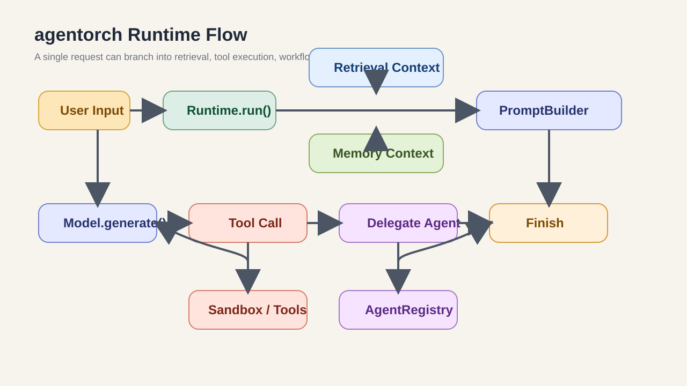

# agentorch

`agentorch` is a code-first, async-first Python agent orchestration framework for building programmable agent systems with tools, workflows, retrieval, memory, sandboxed execution, and multi-agent delegation.


## Why agentorch

Many agent frameworks are either too prompt-heavy, too hidden behind DSLs, or too tightly coupled to a single execution style. `agentorch` is designed as a low-level, Python-native orchestration layer that keeps core boundaries explicit:

- `models` normalizes provider interaction
- `tools` defines atomic structured actions
- `sandbox` isolates high-risk execution
- `memory` manages thread state and long-term records
- `knowledge` provides RAG-ready retrieval interfaces
- `workflow` gives you Python-defined DAG orchestration
- `agents` adds registries, task handoff, supervisor routing, and workflow agent nodes
- `runtime` connects everything together

The goal is not to hide orchestration, but to make it programmable, inspectable, and extensible.

## What It Supports Today

- OpenAI-compatible chat model access
- Structured tool registration and tool calling
- Sandboxed Python code execution via a code interpreter tool
- Thread memory, long-term records, and checkpoints
- Python API workflow DAGs
- RAG-ready knowledge interfaces with a minimal in-memory retriever
- Multi-agent registration and supervisor-based delegation
- Workflow-level agent nodes
- Structured tracing and usage tracking

## Architecture at a Glance



At runtime, `agentorch` can combine:

1. user input and thread memory
2. optional retrieval context from a `KnowledgeBase` or `BaseRetriever`
3. tool schemas and skill instructions
4. a model call that may produce a direct answer, tool calls, or delegated agent work
5. execution through tools, workflows, or supervisors

## Installation

For local development:

```bash
pip install -e .
```

For the published package later:

```bash
pip install agentorch
```

Recommended Python version:

```text
Python 3.11+
```

## Environment Setup

`agentorch` automatically reads a local `.env` file in the project root and supports both:

- `OPENAI_API_KEY` / `OPENAI_BASE_URL`
- `API_KEY` / `BASE_URL`

Recommended:

```env
OPENAI_API_KEY=sk-xxxx
OPENAI_BASE_URL=https://api.openai.com/v1
```

If you use an OpenAI-compatible gateway, a full `.../chat/completions` URL is normalized automatically to the required `/v1` base URL.

## Quick Start

### 1. Minimal agent

Use this in a normal Python script:

```python
from agentorch import Agent, OpenAIModel, Runtime

runtime = Runtime(model=OpenAIModel(model="gpt-4.1"))
agent = Agent(runtime=runtime)

result = agent.run_sync(
    "Explain what agentorch is in three short sentences.",
    thread_id="quickstart-001",
)

print(result.output_text)
```

In notebooks, use:

```python
result = await agent.run("Explain what agentorch is.", thread_id="nb-001")
```

### 2. Structured tool calling

```python
from pydantic import BaseModel

from agentorch import Agent, OpenAIModel, Runtime, ToolRegistry, tool


class AddInput(BaseModel):
    a: int
    b: int


@tool(description="Add two integers together.")
async def add_numbers(input: AddInput):
    return {"sum": input.a + input.b}


tools = ToolRegistry()
tools.register(add_numbers)

runtime = Runtime(model=OpenAIModel(model="gpt-4.1"), tools=tools)
agent = Agent(runtime=runtime)

result = agent.run_sync(
    "Use the add_numbers tool to calculate 123 + 456 and explain the result.",
    thread_id="tool-demo-001",
)

print(result.output_text)
print(result.tool_results)
```

### 3. Code interpreter with sandbox

```python
from pathlib import Path

from agentorch import SandboxManager, create_python_interpreter_tool
from agentorch.sandbox import SandboxPolicy

sandbox = SandboxManager(
    policy=SandboxPolicy(
        allowed_paths=[Path.cwd()],
        command_allowlist=["python"],
        timeout=10.0,
    )
)

tool = create_python_interpreter_tool(sandbox)

# In a notebook:
result = await tool.run(
    tool.input_model(
        code="""
values = [1, 2, 3, 4]
print(sum(values))
print(values[-1])
""",
        workdir=str(Path.cwd()),
    )
)

print(result.data["stdout"])
```

### 4. RAG-ready runtime

```python
from agentorch import Agent, InMemoryKnowledgeBase, OpenAIModel, Runtime
from agentorch.config import RuntimeConfig
from agentorch.knowledge import Document

knowledge_base = InMemoryKnowledgeBase()
await knowledge_base.ingest(
    [
        Document(
            id="doc-1",
            text="agentorch is designed for code-first, async-first agent orchestration in Python.",
        )
    ]
)

runtime = Runtime(
    model=OpenAIModel(model="gpt-4.1"),
    knowledge_base=knowledge_base,
    config=RuntimeConfig(enable_retrieval=True, max_retrieved_chunks=3),
)

agent = Agent(runtime=runtime)
result = await agent.run("What is agentorch designed for?", thread_id="rag-demo-001")
print(result.output_text)
```

### 5. Multi-agent supervisor delegation

```python
from pydantic import BaseModel

from agentorch import Agent, AgentRegistry, AgentSpec, OpenAIModel, Runtime, Supervisor, ToolRegistry, tool


class EchoInput(BaseModel):
    text: str


@tool(description="Echo a message as structured data.")
async def echo(input: EchoInput):
    return {"echo": input.text}


def build_specialist_agent(description: str) -> Agent:
    tools = ToolRegistry()
    tools.register(echo)
    runtime = Runtime(model=OpenAIModel(model="gpt-4.1"), tools=tools)
    return Agent(runtime=runtime)


registry = AgentRegistry()
planner = build_specialist_agent("Planning specialist for decomposition tasks")
registry.register(
    AgentSpec(name="planner", description="Planning specialist", tags=["plan", "task"]),
    planner,
)

supervisor = Supervisor(registry=registry)
runtime = Runtime(
    model=OpenAIModel(model="gpt-4.1"),
    agent_registry=registry,
    supervisor=supervisor,
)
agent = Agent(runtime=runtime)

result = await agent.run(
    "Please plan the implementation steps for a Python agent framework.",
    thread_id="supervisor-demo-001",
)

print(result.output_text)
```

## Public API

The current top-level API includes:

```python
from agentorch import (
    Agent,
    AgentRegistry,
    AgentSpec,
    BaseRetriever,
    Context,
    InMemoryKnowledgeBase,
    KnowledgeBase,
    MemoryManager,
    OpenAIModel,
    Runtime,
    SandboxManager,
    SkillLoader,
    SkillRegistry,
    Supervisor,
    TaskPacket,
    ToolRegistry,
    Workflow,
    create_python_interpreter_tool,
    tool,
)
```

## Project Layout

```text
agentorch/
├── agents/          # Agent registry, task packets, supervisor orchestration
├── config/          # Typed runtime and model configuration
├── core/            # Shared message, response, and decision types
├── knowledge/       # RAG-ready retrieval abstractions and minimal local retriever
├── memory/          # Thread memory, long-term records, checkpoints
├── models/          # Provider adapters
├── observability/   # Event bus, tracing, logging, usage tracking
├── parsing/         # Structured parsing helpers
├── plugins/         # Extension surface for future plugins
├── prompts/         # Prompt templates and message construction
├── reasoning/       # Policies and decision-making abstractions
├── runtime/         # Runtime orchestration and agent entrypoint
├── sandbox/         # Sandboxed execution backends
├── skills/          # Skill package loading and registry
├── tools/           # Structured tools and code interpreter
└── workflow/        # Python-defined workflow DAGs
```

## Examples

You can inspect the runnable examples in:

- [`examples/basic_agent.py`](examples/basic_agent.py)
- [`examples/code_interpreter_agent.py`](examples/code_interpreter_agent.py)
- [`examples/rag_ready_runtime.py`](examples/rag_ready_runtime.py)
- [`examples/supervisor_agents.py`](examples/supervisor_agents.py)

And the full interactive notebook in:

- [`agentorch_experiments.ipynb`](agentorch_experiments.ipynb)

## Testing

Run the test suite with:

```bash
py -3.13 -m pytest -q
```

The current repo includes tests for:

- tools
- sandbox execution
- memory behavior
- workflow routing
- OpenAI-compatible tool call formatting
- RAG-ready retrieval interfaces
- agent registry and supervisor delegation
- prompt building behavior

## Design Notes

`agentorch` intentionally keeps several boundaries explicit:

- `memory` is not `knowledge`
- `tools` are not workflows
- `skills` are not execution engines
- `supervisor` is not free-form multi-agent chat
- `RAG` is integrated through interfaces, not hardcoded into memory

This keeps the framework small enough for experimentation while still leaving room for production-grade backends and research-driven extensions.

## Current Scope and Future Direction

Current focus:

- code-first orchestration
- async-first execution
- structured tool and agent boundaries
- minimal but extensible RAG and multi-agent support

Natural next steps:

- richer document ingestion and chunking
- better retriever / reranker backends
- stronger supervisor routing strategies
- more advanced multi-agent coordination patterns
- richer artifacts and file-based code interpreter workflows

## License

MIT
