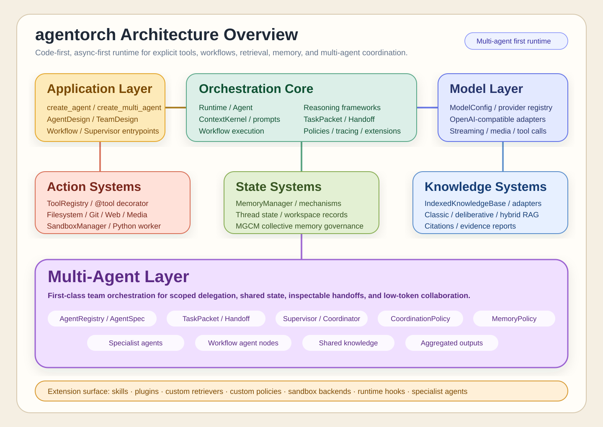
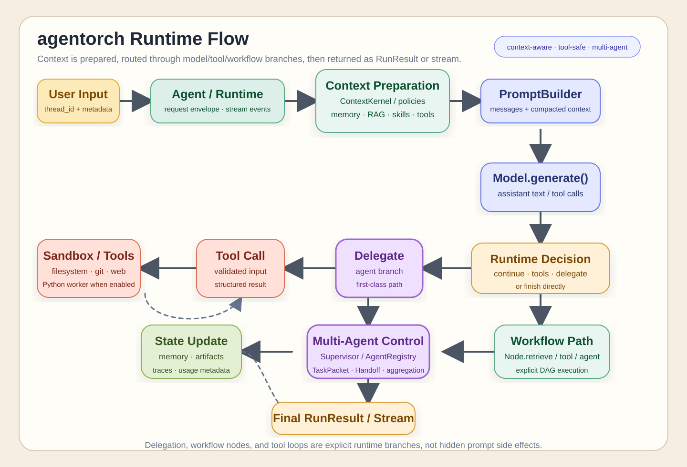

<h1 align="center">agentorch</h1>

<p align="center">
  <strong>代码优先 · 异步优先的 Python 多智能体编排框架</strong>
</p>

<p align="center">
  
</p>

<p align="center">
  <a href="README.md">English</a> |
  <a href="README.zh-CN.md">简体中文</a> |
  <a href="README.zh-TW.md">繁體中文</a> |
  <a href="README.fr.md">Français</a> |
  <a href="README.ja.md">日本語</a> |
  <a href="README.ko.md">한국어</a> |
  <a href="README.es.md">Español</a>
</p>

<p align="center">
  
  
  
  
  
</p>

> 面向真实工程边界的智能体运行时：把模型、工具、检索、记忆、工作流和多角色协作，组织成清晰、可观测、可演进的软件结构。

`agentorch` 的 PyPI 发行名是 `masarch`，安装使用 `pip install masarch`，代码中使用 `import agentorch`。

## 项目介绍

本项目适用于需要“可控智能体系统”的团队和研究者，而不是只依赖提示词拼接的黑盒流程。它提供明确的运行时对象、策略边界和结构化状态，让复杂任务从单智能体自然扩展到多智能体协作。

### 适用场景

- **代码助手**：文件、命令、Git、审查和权限控制协同。
- **知识助手**：检索证据、RAG、引用链和可解释输出。
- **自动化流程**：工作流 DAG、节点级重试、审计和持久化。
- **长程任务**：线程、工作区、跨轮记忆和可恢复执行。

### 仓库结构

| 目录 | 内容 |
| --- | --- |
| `agentorch/` | 框架核心、运行时、模型、工具、记忆和工作流 |
| `projects/` | AI 文本检测、AI 短剧等应用项目 |
| `experiments/` | 长期记忆、上下文和基线实验代码 |
| `resource/` | 架构图、运行流程图和品牌图标 |
| `tests/` | 跨模块集成测试与项目测试 |
| `data/` | 本地数据约定；原始数据默认不上传 |

## 技术栈

| 层级 | 技术 | 用途 |
| --- | --- | --- |
| 核心语言 | Python 3.10+、`asyncio` | 异步优先的运行时与任务调度 |
| 类型与校验 | Pydantic | 请求、响应、工具输入和配置校验 |
| 模型适配 | OpenAI API、兼容接口 | 对接聊天、Embedding、视觉和语音模型 |
| 编排运行时 | Runtime、Workflow DAG | 路由、委派、交接、重试和状态管理 |
| 工具系统 | filesystem、execution、git、web、media | 受策略控制的工具调用能力 |
| 知识与记忆 | RAG、Memory、Neo4j 扩展 | 检索证据、长期记忆和图结构存储 |
| 工程质量 | pytest、Jinja2、HTTPX | 测试、代码生成、模板和网络适配 |

## 核心能力

<p>
  
  
  
  
  
</p>

- 模型适配、结构化输出和流式响应
- 工具注册、白名单、沙箱与权限策略
- `react`、`plan_execute` 等推理策略
- 多智能体委派、任务包和显式交接记录
- RAG 检索、证据挂载、记忆保留与晋升
- 工作流编排、运行追踪和可观测性事件

### 架构总览



### 运行流程



架构图、技术栈图标和项目 Logo 位于 [`resource/brand`](resource/brand)，可直接复用到文档、演示和前端项目中。

> 数据集、数据库、模型文件和实验运行产物默认不上传 GitHub。请阅读 [`data/README.md`](data/README.md)，只提交字段说明、下载脚本、版本号和脱敏样例。

## WHY

### 为什么做这个框架 🎯

很多项目在“一个助手 + 一段提示词”阶段跑得很快，但一旦进入工程化就容易失控：

- 角色越来越多，但职责边界不清
- 工具能力越来越强，但安全约束不成体系
- 上下文越来越长，但状态不可追踪
- 检索越来越复杂，但证据链不可复核

`agentorch` 的目标是把这些问题从“隐式 prompt 技巧”变成“显式软件结构”。

### 为什么对工程团队有价值 🧭

- 运行时装配可导出、可检查、可调试
- 策略边界可配置、可版本化
- 能从单智能体平滑升级为多智能体协作
- 可以对推理/RAG/工作流策略做持续迭代

### 为什么对研究团队有价值 🔬

- 可切换推理策略（如 `react`、`plan_execute`）
- 可比较不同 RAG 与上下文策略组合
- 可做进化搜索与策略实验
- 能保留多轮任务中的结构化状态

### 典型适用场景

- 代码助手：需要文件、命令、Git、审查协同
- 知识助手：需要检索证据并保持可解释输出
- 自动化流程：需要 DAG 节点级控制与审计
- 长程任务：需要线程/工作区/跨轮记忆复用

## WHAT

### 核心入口 API

- `create_agent(...)`
- `create_multi_agent(...)`

默认建议从这两个入口开始，不必先下沉到底层装配。

### 关键能力模块 🧩

- 模型适配层（OpenAI 与兼容接口）
- 工具注册与工具包（filesystem / execution / git / web / media）
- 沙箱执行与权限策略
- 知识库与 RAG 策略
- 记忆管理与记忆治理
- 工作流 DAG 编排与执行
- 可观测性事件与持久化追踪

### 编排在这里具体指什么

在 `agentorch` 中，编排不是一个模糊概念，而是有明确对象与边界：

- 总指挥负责路由与委派
- 任务包是可追踪的执行单元
- 交接记录是显式结构，不是隐式聊天
- 共享状态受策略约束
- 工具可见性和权限可控

### 稳定性与兼容性

- Python `3.10+`
- 核心依赖保持轻量
- 高层 facade API 面向稳定使用
- 兼容导出可覆盖存量代码迁移

## HOW

### 安装 📦

从 PyPI 安装：

```bash
pip install masarch
```

如果当前镜像源还没有同步最新版本，临时使用官方 PyPI 源：

```bash
pip install -i https://pypi.org/simple --no-cache-dir masarch
```

确认安装版本和导入路径：

```bash
python -c "import importlib.metadata as m; import agentorch; print(m.version('masarch')); print(agentorch.__file__)"
```

查询 PyPI 已发布版本：

```bash
pip index versions masarch -i https://pypi.org/simple
```

本地开发安装：

```bash
pip install -e .
```

直接从 GitHub 安装：

```bash
pip install "git+https://github.com/Akun-python/agentorch.git"
```

可选依赖示例：

```bash
pip install "masarch[neo4j]"
```

本地开发并启用可选依赖：

```bash
pip install -e ".[neo4j]"
```

### 环境变量配置

```env
OPENAI_API_KEY=sk-xxxx
OPENAI_BASE_URL=https://api.openai.com/v1
OPENAI_EMBEDDING_MODEL=text-embedding-3-small
```

本地 `.env` 建议显式加载，不建议隐式注入。

### 推荐落地顺序

1. 先用单智能体跑通核心任务。
2. 再加入必要工具，控制权限范围。
3. 再打开 RAG（并验证证据质量）。
4. 最后再引入多智能体委派与策略协同。

### 验证命令

```powershell
py -3.10 -m pytest -q
```

```powershell
py -3.10 -m pytest -q agentorch/tests/test_readme_contracts.py
```

### 工程守则 ✅

- 工具白名单尽量小
- 线程 ID 显式化，便于追踪
- 长任务拆分为可检查步骤
- 运行结束后及时关闭 runtime / agent

## QUICKSTART

### 1) 最小可运行示例

```python
from agentorch import create_agent

agent = create_agent(
    model="gpt-4.1-mini",
    system_prompt="你是一个简洁且准确的助手。",
    reasoning="react",
)

result = agent.run_sync(
    "请用三个要点解释什么是智能体编排。",
    thread_id="quickstart-zh-cn-001",
)

print(result.output_text)
agent.close()
```

### 2) 工具调用示例

```python
from pydantic import BaseModel

from agentorch import ToolRegistry, create_agent, tool

class AddInput(BaseModel):
    a: int
    b: int

@tool(description="Add two integers.")
async def add_numbers(input: AddInput):
    return {"sum": input.a + input.b}

agent = create_agent(
    model="gpt-4.1-mini",
    tools=ToolRegistry.from_tools(add_numbers),
    reasoning="react",
)

result = agent.run_sync("请调用 add_numbers 计算 12 + 30。", thread_id="quickstart-tools-zh-cn-001")
print(result.output_text)
agent.close()
```

### 3) 多智能体起步示例

```python
from agentorch import create_agent, create_multi_agent

planner = create_agent(model="gpt-4.1-mini", reasoning="plan_execute", name="planner")
reviewer = create_agent(model="gpt-4.1-mini", reasoning="react", name="reviewer")

team = create_multi_agent(
    model="gpt-4.1-mini",
    agents=[
        {"agent": planner, "name": "planner", "role": "planner"},
        {"agent": reviewer, "name": "reviewer", "role": "reviewer"},
    ],
    system_prompt="协调专家并返回一个最终答案。",
)

result = team.run_sync("先制定再评审一个迁移方案。", thread_id="quickstart-team-zh-cn-001")
print(result.output_text)
team.close()
```

### 4) 下一步建议

从原型走向可维护系统时，建议一次只明确一个新的工程边界：

#### A. 使用 RAG 挂载项目知识

通过 `knowledge_paths` 指向本地 Markdown、文本、代码或框架支持的文档，
并设置 `enable_rag=True`，让检索成为运行时契约，而不是散落在提示词拼接中。
目录应保持小而清晰，只放可复现、可共享的资料；不要直接指向原始数据集或生成产物。

```python
from agentorch import create_agent

agent = create_agent(
    model="gpt-4.1-mini",
    enable_rag=True,
    knowledge_paths=["docs/", "src/"],
    knowledge_scope=["public-docs", "source-code"],
)
result = agent.run_sync("根据项目文档解释认证流程。", thread_id="rag-001")
print(result.output_text)
agent.close()
```

#### B. 用 Workflow DAG 固化关键步骤

当步骤顺序、重试边界、人工审批点或智能体交接需要被检查时，使用 Workflow。
将开放式推理放在 model 节点中，将工具、检索、审批和聚合等系统边界写成显式节点。

```python
from agentorch import WorkflowBuilder, create_agent
from agentorch.workflow import Node

workflow = (
    WorkflowBuilder(max_steps=8)
    .add(Node.retrieve("retrieve", question="用户问题"), entry=True)
    .then(Node.model_node("draft", prompt="基于检索证据形成初稿。"))
    .then(Node.model_node("review", prompt="检查事实、引用和风险。"))
    .build()
)
agent = create_agent(model="gpt-4.1-mini", workflow=workflow)
result = agent.run_sync("整理本次变更", thread_id="workflow-001")
agent.close()
```

#### C. 开启 Observability 做成本与质量分析

Observability 会将运行事件、Token 使用量、交接记录和失败上下文写入本地 SQLite。
建议使用项目内路径、启用脱敏，并按模型版本、提示词版本、工作流版本和任务类型比较追踪结果。

```python
from agentorch import create_agent
from agentorch.config import ObservabilityConfig

agent = create_agent(
    model="gpt-4.1-mini",
    observability=ObservabilityConfig(
        enabled=True,
        sqlite_path=".agentorch/observability.db",
        console_mode="important_only",
    ),
)
```

至少关注：成功率、工具失败率、延迟、输入/输出 Token、估算成本、检索命中质量、
引用覆盖率和人工兜底率。不要把 API Key、原始个人信息或数据集写入追踪 payload。

#### D. 用策略对象固定团队行为边界

策略对象是可执行配置。建议将其写入代码或经过评审的配置文件，固定团队的上下文、状态、
路由、记忆和工具行为，使多智能体协作结果可预测、可回归。

```python
from agentorch import (
    ContextPolicy,
    CoordinationPolicy,
    MemoryPolicy,
    StatePolicy,
    create_multi_agent,
)

team = create_multi_agent(
    model="gpt-4.1-mini",
    roles=[
        {"name": "planner", "description": "负责规划", "capabilities": ["plan"]},
        {"name": "reviewer", "description": "负责审查", "capabilities": ["review"]},
    ],
    context_policy=ContextPolicy.evidence_friendly(),
    state_policy=StatePolicy(retention_mode="state_plus_memory"),
    coordination_policy=CoordinationPolicy.distributed(),
    memory_policy=MemoryPolicy.long_horizon(),
)
```

建议从最小权限开始：收紧工具白名单、显式设置知识范围、限制委派深度、使用 `summary_only`
交接。只有评估证明确有收益时，再扩大策略边界。

#### E. 补齐生产闭环

- 为模型适配器、工具、策略和 Workflow 边补充单元测试与契约测试。
- 在消耗真实模型额度前，用 Mock Provider 完成端到端测试。
- 维护小型、版本化评估集，覆盖任务成功率、事实 grounding、安全、延迟和成本；对比时固定模型和提示词版本。
- 持久化 thread ID 与 workflow 版本，使失败运行可以复现或恢复，同时不上传本地数据。
- 对破坏性操作、外部消息和高风险工具调用增加人工审批节点。
- 部署时设置并发上限、超时、重试、限流、健康检查和明确的优雅关闭流程。

MIT License.
