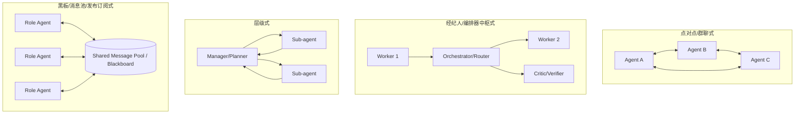
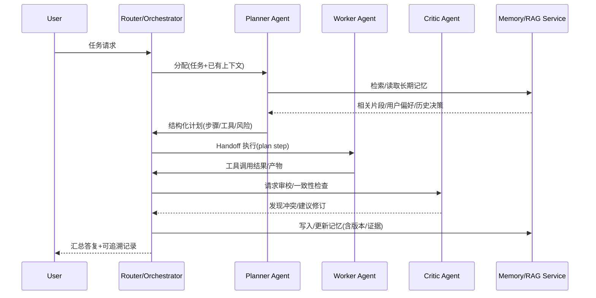

# 多智能体LLM系统的交互、上下文与记忆协同：近年文献综述

## 执行摘要与范围界定

过去约三年，“LLM 作为智能体（agent）”从单体规划/执行迅速演化为**多智能体LLM系统（LLM-based Multi-Agent Systems, LLM-MAS）**：多个具备不同角色/工具/权限的LLM实例通过对话或结构化消息协作完成长程任务。典型代表包括以“多智能体对话编排”为核心的 AutoGen 框架 citeturn0search0turn0search4turn10search10，以“标准作业流程（SOP）+结构化沟通+发布订阅”为核心的 MetaGPT citeturn0search3turn10search7turn10search11，以及聚焦“有状态、可恢复、可持久化执行”的 LangGraph 运行时与图式编排 citeturn13search0turn10search0turn10search1。与此同时，**跨框架互操作**与“在工具/数据系统周边安全地传递上下文”成为新焦点：Anthropic 提出的 MCP（Model Context Protocol）旨在标准化“模型↔工具/数据源”的上下文接入 citeturn4search0turn4search4turn4search8；而面向“智能体↔智能体”互联的 A2A（Agent2Agent）协议专门解决独立智能体系统间发现、能力协商与协作任务管理的协议层问题 citeturn4search1turn15search11turn4search17。

本综述聚焦“当前多智能体LLM如何交互、如何做上下文管理、以及如何做记忆（memory）协同与一致性”，时间范围以**近5–7年（约2019–2026）**为主，并纳入少量奠基性经典工作：多智能体通信语言与交互协议（KQML、FIPA-ACL、Contract Net） citeturn5search13turn5search9turn5search3，认知心理学的“工作记忆/情景记忆/语义记忆”区分 citeturn11search1turn11search0，以及分布式一致性机制（Raft、CRDT） citeturn11search3turn6search11。评测方面，除通用智能体基准（AgentBench） citeturn1search3turn1search15，近两年出现了**专门面向多智能体协作/竞争**的 MultiAgentBench（MARBLE） citeturn3search0turn3search10turn3search3，以及更偏“分布式计算图任务（含 leader election/consensus）”的 AgentsNet 基准提案 citeturn3search7。安全层面，研究已从“直接提示注入”扩展到“间接提示注入（IPI）/记忆与RAG投毒/数据外泄”，并出现了对应基准与防护论文（如 InjecAgent、AgentPoison、OpenAI 的 URL 外泄防护研究） citeturn8search0turn8search6turn8search10。

## 概念定义与系统分类法

**LLM 智能体**通常指：以 LLM 为核心决策/生成模块，具备（部分或全部）任务分解、计划、调用工具、读写状态/记忆、与环境交互的系统。**多智能体LLM系统**则进一步由多个智能体组成，通过消息交互实现分工协作或竞争，以提升任务覆盖面、鲁棒性或吞吐。AutoGen 将其核心抽象为“可对话的（conversable）代理”及“可编程的对话模式”，用自然语言与代码共同定义交互结构 citeturn0search0turn10search6turn10search10；MetaGPT 则强调把“软件公司流程”编码为 SOP，并要求中间产物结构化输出以降低级联幻觉与沟通歧义 citeturn0search3turn10search7turn10search11；CAMEL 以“角色扮演（role-playing）”方式构建 agent society，用于研究多智能体协作对话与指令跟随行为 citeturn1search0turn9search4turn1search4。

为了讨论“交互/上下文/记忆协同”，推荐把系统拆为三层对象：

**交互（interaction）**：智能体之间（或智能体与编排器/环境之间）的消息交换与控制流；  
**上下文（context）**：一次调用时输入给 LLM 的“可见信息集合”（含对话历史、检索片段、工具返回、系统指令等），通常受上下文窗口限制；  
**记忆（memory）**：跨轮次/跨会话保存并可检索/可更新的状态，可实现“长程连续性”。LangGraph 将“短期记忆”显式建模为图的 state，并通过 checkpointer 持久化到数据库以支持线程隔离、续跑与人类在环 citeturn10search1turn10search0；LlamaIndex 也将 memory 作为模块，并提到默认的 ChatMemoryBuffer（基于 token 限额保留最近消息）及更灵活的 Memory 类（同时指出旧 buffer 方案将被替代） citeturn9search3。

在角色（roles）层面，多智能体系统常见的功能角色可归纳为：  
**任务型角色**（研究/规划/执行/写作/编码/测试等）、**控制型角色**（路由/调度/经理/裁判/审校）、**资源型角色**（工具代理、检索代理、数据代理）、以及**安全治理型角色**（策略守卫、合规/红队、输出审查）。OpenAI Agents SDK 将“handoff（交接）”作为一等机制，强调不同专长代理之间的任务委派 citeturn4search3turn4search7turn9search9。MetaGPT 的“产品经理/架构师/工程师”等社会化分工则是典型的“角色专门化 + SOP 串联” citeturn10search3turn0search3。

在交互拓扑（interaction topology）上，当前主流可用一个“控制权在哪、消息如何路由”的分类法统一理解：

上述四类在文献与开源系统中均有直接对应：CAMEL 的 role-playing 对话更接近 P2P/群聊范式 citeturn1search0turn9search4；OpenAI Agents SDK 的 handoff/路由常用于“中枢式/层级式”工作流 citeturn4search3turn4search7；LangGraph 支持“单体、多智能体、层级”等控制流设计 citeturn0search1turn13search0；MetaGPT 则明确实现“共享消息池 + 发布订阅 + 结构化通信接口” citeturn10search7turn10search11。经典 MAS 里的“市场/招投标式任务分配”可追溯到 Contract Net Protocol（1980），为后续的协商与任务分配机制提供了高层协议模板 citeturn5search3。

## 交互范式、通信协议与协调机制

### 通信协议与消息格式

多智能体LLM的“通信”从工程实现上可分为四个层级，分别对应不同的信息结构化程度与互操作目标：

**自然语言文本（Text-only chat）**：实现最快、表达力强，但语义边界模糊、难以验证与约束。ChatDev 直接把软件开发流程串联为多代理对话，并强调通过设计“chat chain”指导“说什么/怎么说” citeturn1search1turn1search13；AutoGen 以“多代理对话编程（conversational programming）”提供多种对话模式模板 citeturn10search6turn0search0。

**半结构化/结构化消息（JSON/Schema/Artifacts）**：把关键中间产物（计划、接口、评审意见、证据）约束为可解析字段，明显提升可控性与可复用性。MetaGPT 明确要求代理输出结构化工件，并认为“中间结构化输出能显著提高目标代码生成成功率”，同时通过发布订阅降低信息过载 citeturn10search7turn10search11。A2A 协议也强调在不同系统间协商交互形态（文本、文件、结构化数据等）并管理协作任务 citeturn15search11turn4search1。

**工具/API 调用层（Tool-use / API-mediated messages）**：当代理可调用外部工具时，“消息”不只是在代理之间流动，也在“代理↔工具↔环境”之间闭环。OpenAI Agents SDK 将 handoff 也抽象为一种“工具”，使 LLM 在 function/tool calling 回路中选择移交给专长代理 citeturn4search3turn4search11turn4search7。MCP 则把“接入外部数据源与工具”规范化为开放协议，目标是减少 N×M 的定制连接成本 citeturn4search0turn4search4turn4search8。

**向量/潜空间通信（Embeddings / Latent communication）**：在传统 MARL 中，学习“离散符号/连续向量通信”是重要方向（例如 Foerster 等提出 DIAL，允许跨代理传递梯度以学习通信） citeturn15search0turn15search4；而在 LLM-MAS 语境下，近期出现“让 LLM 代理在连续潜空间直接协作”的 LatentMAS（训练自由/无需端到端训练的主张，细节以论文为准） citeturn15search14。这类方法被讨论的动机通常包括：降低 token 带宽、减少提示注入面、以及提升隐私（但是否真正安全仍需严谨威胁模型与评测）。

在“协议语义”层面，经典 MAS 的 FIPA-ACL 与 KQML 提供了“言语行为（speech act）/performative”思想：消息不仅有内容，还带有意图类型（如 request、inform、propose 等），并可组合成标准交互协议。FIPA-ACL 在 2002 年左右形成较系统的消息结构规范 citeturn5search9turn5search0；KQML 早期也被定义为“消息格式 + 消息处理协议”，服务于运行期知识共享 citeturn5search13turn5search2。这些思想在今天的 LLM-MAS 中以“结构化对话行为”“工具调用意图”“发布订阅主题”等形式回潮，但工程落地更常借助 JSON Schema、工具签名、以及 tracing/审计日志，而不是完整复刻 ACL 体系。

### 协调机制：从协商到共识、从分工到选主

多智能体协调（coordination）可视为在三个约束下的控制问题：**信息分布**（每个代理知道什么）、**行动耦合**（谁能做什么/调用什么工具）、**资源预算**（token、时间、工具额度）。当前主流机制可以归纳为：

**任务分配（Task allocation）与流程编排（Workflow）**：  
Contract Net Protocol 提供“发布任务→投标→授标→执行→反馈”的模板，强调通过协商实现分布式任务共享 citeturn5search3。在 LLM-MAS 中，工程上更常见的是“角色分工 + SOP/图式流程”：MetaGPT 直接把 SOP 编码为提示序列，以“流水线/装配线范式”分解复杂任务 citeturn0search3turn10search3；LangGraph 则通过“状态图 + 持久化 checkpoint”让编排具备循环、分支、人工审批与可恢复执行能力 citeturn10search0turn13search0。

**多轮讨论、辩论与投票式共识（Debate/Consensus）**：  
多智能体辩论被用于提升推理与事实性：Du 等提出让多个模型实例提出并辩论，最终形成共同答案的方案 citeturn12search5turn12search1；Liang 等研究“多智能体辩论促进发散思维”并在 EMNLP 2024 给出系统实验 citeturn12search4turn12search0。但也有工作开始反思“多智能体讨论是否必然提升推理边界”，提示需要更细的机制设计与对照实验 citeturn12search7。在工程实践中，“批判者/审校者/裁判者代理 + 自一致性/多数表决”常与辩论结合，形成可控的共识管线。

**选主（Leader election）与分布式一致性（Consensus algorithms）**：  
当系统需要一个“全局协调者”来裁决冲突、提交共享记忆更新或串行化关键步骤时，会出现“逻辑领导者”。分布式系统里 Raft 将一致性分解为 leader election、日志复制与安全性，作为可实现的共识算法被广泛采用 citeturn11search3turn11search7。在 LLM-MAS 评测上，AgentsNet 明确把 leader election、consensus 等经典图任务引入多代理消息传递约束下进行评估（其论文状态以 OpenReview 页面为准） citeturn3search7。这类基准的价值在于把“协调”从主观印象变成可计量的协议达成能力。

**纠错与反思（Reflection/verification loops）**：  
单代理层面，Reflexion 用“语言化反思 + 情景记忆缓冲”在多次尝试中自我改进 citeturn2search3turn2search7；多智能体系统里，这通常被外化为“执行者↔评审者↔修订者”的回路，并辅以结构化工件与可追踪的中间状态（MetaGPT 的动机之一正是减少级联幻觉与逻辑不一致） citeturn0search3turn10search7。

下面用一个“中枢式 + handoff + 记忆服务”的交互序列示意常见工程实现（示意图不绑定特定框架）：

与此对应的现实框架要点包括：OpenAI Agents SDK 将 handoff 表示为工具从而进入模型的工具选择回路 citeturn4search3turn4search7；LangGraph 把“状态更新+checkpoint”作为每一步的持久化单元 citeturn10search0turn10search1。

## 上下文管理策略

LLM-MAS 的上下文管理，核心矛盾是：**上下文窗口有限**，但系统需要长程依赖、多人协作信息与工具证据；且多智能体意味着“上下文分裂”（每个代理看到的不同）与“上下文传播成本”（互相转述耗 token、易失真）。

### 本地上下文与共享上下文

**本地上下文（local-only）**通常指：每个代理维护自己的对话历史与当前工作记忆（working context），不与其他代理直接共享，仅通过自然语言转述或总结传递。它实现简单且隔离性强，但信息复制成本高、容易遗漏关键证据。

**共享上下文（shared state/context）**则把关键状态放入可复用存储：  
LangGraph 明确提供内置 persistence：在每步执行保存图状态 checkpoint，并以 thread 组织，从而支持“会话记忆、时间旅行调试、容错执行” citeturn10search0turn10search1。这种“状态即上下文”的做法，使多代理在同一图/线程下能读写同一份状态数据（当然读写权限与冲突策略仍需设计）。

MetaGPT 的共享方式更像“黑板/消息池”：各角色把结构化产物 publish 到共享池，再由订阅者按需读取，减少全量广播造成的信息过载 citeturn10search7turn10search11。

### 上下文窗口化、检索增强与压缩

当前主流技术栈几乎都在组合三类策略：

**检索增强上下文（RAG）**：把“非参数记忆”放到外部索引里，通过检索把相关片段注入上下文。RAG 的经典表述是把参数化记忆（模型权重）与非参数化记忆（向量索引）结合，用可微检索器从 Wikipedia 等知识库取证据 citeturn6search0turn6search4。在多智能体场景中，RAG 既可作为每个代理的独立能力，也可作为共享服务（统一检索、统一证据格式），以减少不同代理“各自检索但证据不一致”的问题。

**摘要与结构化总结（Summarization/structuring）**：把长历史压缩成“可继续对话的摘要状态”。虽然纯摘要容易丢细节，但配合“可回溯原文/带引用的摘要”能在成本与正确性之间折中；LangGraph 的可持久化线程与时间旅行调试能力，为这种“摘要+回放”提供工程基础 citeturn10search0。

**提示压缩（Prompt compression）与关键片段密度优化**：LLMLingua 提出 coarse-to-fine 的提示压缩方法，在高压缩比情况下尽量保持语义完整性 citeturn7search0turn7search4；LongLLMLingua 进一步面向长上下文场景，强调通过压缩提高关键信息密度、缓解位置偏置并降低成本 citeturn7search1turn7search9。在多智能体系统里，这类压缩常用于“跨代理传递摘要包”：把一个代理的长推理轨迹压缩成另一个代理可消费的上下文。

### 链式、分支式与并行式上下文组织

多智能体并不一定意味着多个进程/多个模型；也可以用“多轨推理”模拟多个观点，再做选择或整合：  
Self-Consistency 通过采样多条推理路径并选择最一致答案，提高 CoT 推理表现 citeturn7search2；Tree of Thoughts 则把中间“thought”当作可探索的搜索节点，支持更显式的分支与回溯 citeturn7search3turn7search7。这些方法在多智能体系统中常被用作“单代理内部的多候选生成器”，再交给“评审者/裁判者代理”聚合，形成混合式架构。

## 记忆系统设计与一致性协调

“记忆”在 LLM-MAS 里至少承担三类功能：保持连续性（长期用户偏好/项目状态）、支持推理（存证据/中间结论）、以及支持协调（共享事实/共享承诺/共享计划）。但多智能体使记忆引入典型分布式难题：并发写入、冲突、毒化、以及不同代理对“同一事实”的表述不一致。

### 记忆类型：工作记忆、情景记忆、语义记忆

从认知科学视角，工作记忆（working memory）强调有限容量下的暂存与操作 citeturn11search1；Tulving 区分了情景记忆（episodic，关于个人事件与时空关系）与语义记忆（semantic，关于词与概念的组织化知识） citeturn11search0。这一框架被大量 LLM agent 工作沿用为工程隐喻：  
- 工作记忆 ≈ 当前上下文窗口中的可见信息；  
- 情景记忆 ≈ 可追溯的交互事件日志（谁在何时做了什么、依据是什么）；  
- 语义记忆 ≈ 从多次情景中抽象出来的稳定知识（偏好、规则、事实库、技能）。

### 代表性记忆架构：分层、反思凝练、图结构

**分层记忆/虚拟上下文**：MemGPT 明确借鉴操作系统“虚拟内存”思想，管理不同记忆层级，并用中断（interrupt）在用户与自身控制流之间切换，以在有限上下文窗口上实现“近似无界”的可用上下文 citeturn2search0turn2search12。这为多智能体系统提供了一个关键启示：记忆管理不只是存储，更是**调度策略**（何时换入、何时换出、如何避免抖动）。

**反思与记忆巩固（consolidation）**：Generative Agents 在架构上记录完整经历（自然语言形式），并通过“反思”把经历综合成更高层的记忆，再在规划时动态检索；论文通过小镇模拟展示了可涌现的社会行为 citeturn2search1turn2search9turn2search13。Hou & Tamoto（2024）则显式讨论“动态类人的回忆与巩固”机制以增强对话代理的认知能力 citeturn6search2。对多智能体而言，这类工作提示：共享记忆如果不做巩固与抽象，会快速膨胀并充满噪声；而巩固策略必须对“多源写入”保持鲁棒。

**结构化世界模型/记忆图谱**：AriGraph 提出让代理在探索环境时构建并更新“整合语义与情景”的记忆图，以支持更强的推理与规划 citeturn6search1。这与 MetaGPT 的“结构化工件”哲学一致：用结构降低歧义、便于一致性检查 citeturn10search7。

### 多智能体共享记忆的一致性问题与工程解法

多智能体共享记忆的核心风险包括：  
- **写写冲突**：两个代理对同一实体/任务状态给出不同更新；  
- **陈旧读**：代理基于过期记忆做决策；  
- **语义冲突**：表面一致但内涵不同（例如“已完成”标准不一致）；  
- **记忆投毒/后门**：攻击者污染长期记忆或RAG库，使未来决策被操控（AgentPoison 就针对“长期记忆或RAG知识库投毒”提出红队方法） citeturn8search6turn8search16。

工程上常见的“协调”手段可以借鉴分布式系统与数据一致性理论：  
CRDT 在强最终一致性（SEC）模型下给出“无冲突复制数据类型”，保证副本在失败与异步条件下仍可收敛 citeturn6search11turn6search3；Raft 则通过选主与复制日志实现一致提交 citeturn11search3。把这些思想映射到 LLM-MAS，可以形成三类可操作设计模式：

**中心化提交（central commit）**：引入“记忆管理员/提交者”代理（或非LLM组件）作为唯一写入口，其他代理只提交提案；类似 Raft 的 leader 模式降低冲突面，但可能成为瓶颈 citeturn11search3。

**乐观并发 + 冲突合并（optimistic + merge）**：允许多代理写入，但用版本号/时间戳/证据链合并；若采用 CRDT 风格数据结构（如可并集合、LWW-Register 的变体），可以保证最终收敛，但需要认真选择“合并语义” citeturn6search11。

**事件溯源（event sourcing）+ 巩固管线**：把每次写入当作不可变事件追加，再由“巩固器”周期性生成语义记忆快照；Generative Agents 的“经历记录→反思→检索”可以视作这一管线的 LLM 版本 citeturn2search1turn2search13。

评测层面，已有工作开始专门测量“代理记忆能力”：MemBench 提出更全面的 LLM/代理记忆评估，并讨论了先前研究中主观评分或间接评估的问题 citeturn6search14。这类基准对多智能体的启示是：记忆不仅要“能存能取”，还要“取对、取稳、取得可解释、且不被投毒”。

## 评测体系、基准与实验设计建议

多智能体系统的评测应当把指标拆到三层：**任务结果**、**交互过程质量**、**上下文/记忆机制效率与一致性**，并在可控协议下做消融（是否共享记忆、是否压缩、是否辩论、拓扑如何变化）。

### 代表性基准与数据集推荐

面向“智能体能力（含交互环境）”的代表：  
AgentBench 提供多维度基准，覆盖多个交互环境以评估 LLM-as-Agent 的决策与推理能力 citeturn1search3turn1search15；WebArena 提供可自托管的真实网页环境与可程序化验证的任务，用于评测 web 操作型代理 citeturn3search1turn3search4turn3search12；SWE-bench 以真实 GitHub issue/代码库评估“修复补丁生成”，常用于软件工程代理评测 citeturn3search2turn3search9。

面向“多智能体协作/竞争”的代表：  
MultiAgentBench 明确针对多智能体协作与竞争，提出 milestone-based KPI，并比较 star/chain/tree/graph 等不同协调拓扑与策略（如 group discussion、cognitive planning） citeturn3search0turn3search3；其代码框架 MARBLE 公开用于系统化评测 citeturn3search10。AgentsNet 则把 leader election、consensus 等分布式图任务引入“邻居通信轮次 + 结构化 JSON 消息”的约束下评估协调能力（论文状态按 OpenReview 为准） citeturn3search7。

面向“记忆能力”的代表：  
MemBench（ACL 2025 Findings）专门讨论对 LLM/代理记忆的综合评测方向 citeturn6search14；而针对“长期记忆与巩固”机制，可参照 Hou & Tamoto 的回忆与巩固设计思路进行任务构造 citeturn6search2。

面向“安全与鲁棒性”的代表：  
InjecAgent 给出工具集成代理在间接提示注入（IPI）下的系统化测试集与统计（含数据外泄意图） citeturn8search0turn8search3；AgentPoison 针对“长期记忆或RAG知识库的后门投毒”提出红队方法 citeturn8search6turn8search16；OpenAI 的研究讨论了代理访问恶意 URL 导致数据外泄的威胁模型与缓解方案（强调简单域名白名单不足） citeturn8search10。OWASP 也把提示注入列为 GenAI 安全头号风险之一，适合用于组织级风险沟通与控制项对齐 citeturn8search9。

### 建议的实验协议与指标体系

为了专门评测“交互、上下文共享、记忆协同”，推荐采用可复现实验协议，而不仅是单次 Demo。以下给出三组可落地的实验设计（每组都建议在 MultiAgentBench 拓扑或 LangGraph/Agent Framework 的可持久化执行器上实现对照） citeturn3search0turn10search0turn14search0：

**分布式信息协作协议（Interaction & sharing）**：把关键事实拆分为“私有信息片段”，随机分配给不同代理，仅允许通过消息交换共享。  
衡量：任务成功率/质量；消息数、token 成本、轮数；信息冗余率（重复转述比例）；“信息覆盖率”（最终解是否包含全部必要片段）；矛盾率/纠错次数。MultiAgentBench 本身强调协作质量与里程碑 KPI，可作为主评测框架 citeturn3search0turn3search3。

**长程连续任务协议（Context window & memory）**：设计跨多会话的任务（例如持续项目管理/用户偏好演化/持续调研），控制每轮可用上下文窗口，比较：  
- 仅短期缓冲（如 token 限额的历史窗口） citeturn9search3  
- RAG 注入 citeturn6search0  
- 反思/巩固（Generative Agents / Hou & Tamoto 风格） citeturn2search1turn6search2  
- 提示压缩（LLMLingua/LongLLMLingua） citeturn7search0turn7search9  
衡量：记忆召回准确性（precision/recall@k）、“有用记忆命中率”（被引用且确实提升结果的比例）、陈旧读比例、随时间的性能衰减曲线、总成本/延迟。

**共享记忆并发一致性协议（Memory coordination & consistency）**：引入并发写入场景：多个代理同时对同一实体状态提出更新（可能冲突），并设置“最终一致”的验收条件（例如必须收敛到同一版本的事实表/任务看板）。  
对照：中心化提交（leader） vs 乐观并发合并（类 CRDT） citeturn11search3turn6search11。  
衡量：冲突次数、收敛时间、最终一致性通过率、回滚/修复次数、冲突解释可读性（可用人评或规则评分）。

安全维度建议作为“并行红队轨”加入每组实验：用 InjecAgent 的 IPI 场景或 AgentPoison 的记忆投毒思路，测量攻击成功率（ASR）、数据外泄率、以及防护策略对任务性能的影响 citeturn8search0turn8search6。

## 代表性系统与框架对比、架构模式与安全挑战

### 代表性系统与开源框架对比表

下表选取近年来具有代表性的多智能体框架/系统/协议实现。若某些细节在官方论文/文档中未明确说明，标注为“未明确说明”。

| 系统/框架 | 年份 | 架构形态 | 交互模型 | 上下文/记忆方法 | 优势 | 局限 | 链接 |
|---|---:|---|---|---|---|---|---|
| AutoGen (Microsoft Research) | 2023/2024 | 多代理对话编排框架 | 多种对话模式（含多代理） | 以对话历史与可编程对话模式组织；长期记忆机制在论文摘要层面未详述 | 把“多代理对话模式”作为可编程原语，覆盖人类在环、工具使用等场景 citeturn0search0turn0search4turn10search6 | 生产级治理/互操作与长期记忆需额外工程；GitHub 提示新用户可转向 Agent Framework（生态迁移期） citeturn10search2 | citeturn0search0turn10search2 |
| Microsoft Agent Framework | 2025–2026 | 面向生产的多智能体工作流/部署框架（Python/.NET） | 支持多智能体工作流与编排；强调互操作 | 官方定位支持 A2A + MCP，并提供工作流与部署形态；具体默认记忆策略依配置而定（未在摘要中统一） | 官方仓库与文档，面向生产；强调跨协议互操作、工作流与部署能力 citeturn14search0turn14search3 | 体系较大，学习与迁移成本可能高（工程权衡项） | citeturn14search0turn14search3 |
| LangGraph (LangChain) | 2024 | 有状态图式编排运行时 | 支持单体/多智能体/层级控制流 | 内置持久化：每步保存图状态 checkpoint，按 thread 组织，支持会话记忆与可恢复执行 citeturn13search0turn10search0turn10search1 | 强状态建模与可恢复执行适合多智能体长任务；支持人类在环、调试与回放 citeturn10search0 | 需要工程化设计 state schema；不当设计会导致状态膨胀/耦合 | citeturn13search0turn10search0 |
| CrewAI | 2023–2026 | 角色扮演式 multi-agent 自动化框架 | 以“crews/roles/flows”组织协作 | 文档强调内置 guardrails、memory、knowledge、observability（细节随版本演进） citeturn0search2turn0search6 | 上手快、社区活跃；强调生产化要素（观测、记忆等） citeturn0search6 | 具体交互协议语义与一致性策略需自行设计；不同版本差异较大（需锁版本实验） | citeturn0search2turn0search6 |
| MetaGPT | 2023 | SOP 驱动的多角色协作框架 | 流水线/装配线式角色分工；消息池发布订阅 | 结构化工件输出 + 共享消息池 + 发布订阅；旨在减少沟通歧义与级联幻觉 citeturn0search3turn10search7turn10search11 | 对“复杂产物生成”（如软件工程工件）更友好；结构化中间产物便于校验与对齐 citeturn10search7 | SOP 需要领域适配；结构化约束提升实现成本 | citeturn0search3turn10search3 |
| CAMEL | 2023 | 角色扮演式 agent society | 点对点/群聊式对话协作 | 以角色扮演与 inception prompting 引导协作对话；记忆/上下文常以对话历史与注入信息实现（细节依实现） citeturn1search0turn9search4 | 适合研究多智能体协作对话、生成多轮数据与社会化行为 citeturn1search4 | 若仅文本对话，易受长上下文与幻觉影响；生产系统需配套记忆与治理 | citeturn1search0turn9search0 |
| AgentVerse (OpenBMB) | 2023 | 多智能体协作与仿真框架 | 支持任务求解与仿真两类框架 | 文档/README 指向多代理部署与应用；具体记忆机制依任务实现（未统一规定） citeturn1search2turn1search6 | 同时覆盖“协作求解”与“社会仿真”；开源可扩展 citeturn1search6 | 框架层抽象与现代工具协议/互操作需自行补齐 | citeturn1search6turn1search2 |
| OpenAI Agents SDK | 2025–2026 | 官方轻量多智能体工作流框架 | 支持多代理 handoff、工具调用与 trace | “handoff 作为工具”实现代理间委派；强调保持完整 trace（具体记忆策略按集成实现） citeturn4search7turn4search3turn9search9 | 官方文档清晰；handoff 模式直接支持专家代理组合 citeturn4search3 | 长期记忆与共享状态需外接/自建；安全治理仍需系统工程（尤其工具场景） | citeturn4search7turn9search9 |
| OpenAI Swarm | 2024 | 教育型轻量多代理编排 | 以函数/工具实现 handoff 与多轮回路 | PyPI 文档强调 run() 不保存调用间状态（需要外部记忆） citeturn13search13turn13search5 | API 面轻、概念直观；适合学习多代理 handoff 思路 citeturn13search5 | 教育型定位；官方建议迁移到 Agents SDK；无内建长期记忆 citeturn13search5turn13search13 | citeturn13search5turn13search13 |
| A2A Protocol | 2025 | 智能体互操作通信协议 | 跨系统 agent↔agent 发现与协作 | 协议层支持能力发现、交互形态协商（文本/文件/结构化数据等）与协作任务管理 citeturn15search11turn4search1turn4search17 | 解决跨框架互联的标准化痛点；与 MCP 互补 citeturn4search17 | 协议落地仍需安全认证、权限与审计体系；生态成熟度取决于采纳 | citeturn4search1turn15search11 |

### 架构模式与参考架构

在企业/生产系统中，多智能体架构往往需要额外组件：代理注册与发现、意图分类与路由、权限治理、观测与审计、以及统一记忆/知识层。Microsoft 的 Multi-agent Reference Architecture 提供了一个“以 Orchestrator 为核心，结合 classifier、registry 等组件”的模块化参考视图，用于设计可治理、可扩展的多代理系统 citeturn9search10turn14search2。这类参考架构与 A2A/MCP 的出现相互呼应：前者强调系统工程分层，后者提供协议层互操作接口 citeturn4search0turn4search1。

### 安全、隐私与鲁棒性挑战

多智能体系统在安全上比单体代理更复杂：攻击面同时包含“提示→代理”“外部内容→代理（间接注入）”“代理→代理（互相污染）”“记忆/RAG→未来决策（投毒）”“工具链→数据外泄”。研究与基准已经把这些风险具体化并可测量化：

- **间接提示注入（IPI）**：InjecAgent 系统化评测工具集成代理在 IPI 下被诱导执行有害动作或外泄数据的风险 citeturn8search0turn8search3。  
- **记忆/RAG 投毒与后门**：AgentPoison 指出通过污染长期记忆或 RAG 知识库可以植入后门，影响未来行为 citeturn8search6turn8search16。  
- **数据外泄**：OpenAI 针对“代理访问恶意 URL 导致数据外泄”的威胁模型提出缓解，并指出简单 allow-list 可能被 open redirect 绕过 citeturn8search10。  
- **组织级风险框架**：OWASP 将提示注入列为 GenAI 关键风险，为制定控制项（输入隔离、最小权限、输出过滤、审计）提供参考框架 citeturn8search9。

从研究趋势看，未来多智能体安全会更多围绕：协议层认证与能力声明（A2A）、上下文接入的最小权限与隔离（MCP）、可验证的中间工件（MetaGPT 式结构化输出）、以及可审计的全链路 trace（Agents SDK 强调 trace）展开 citeturn15search11turn4search0turn10search7turn4search7。

### 开放问题与未来方向

结合以上文献，当前最重要的开放问题集中在五个方面：

其一是**跨框架互操作与标准化**：A2A/MCP 解决了“能连”问题，但“连上后如何确保语义一致、权限一致、审计一致”仍缺少行业共识与大规模实证 citeturn4search0turn4search1turn4search17。  
其二是**上下文与记忆的成本—正确性前沿**：压缩（LLMLingua/LongLLMLingua） citeturn7search0turn7search9、检索（RAG） citeturn6search0、巩固（Generative Agents/Hou & Tamoto） citeturn2search1turn6search2 的最佳组合仍高度依赖领域与任务分布，且缺少多智能体统一基准。  
其三是**共享记忆一致性与可解释冲突解决**：把 CRDT/Raft 等一致性理论映射到“语义状态”远比映射到 KV/日志困难 citeturn6search11turn11search3；需要把“证据、置信度、来源、时效性”纳入数据模型。  
其四是**协作的真实度量**：MultiAgentBench/AgentsNet 等推动了可测量化，但仍需要更贴近真实组织协作的任务与指标体系（例如责任分配、依赖管理、审计可用性） citeturn3search0turn3search7。  
其五是**安全与鲁棒性在多代理闭环中的系统化保证**：从 InjecAgent 到 AgentPoison 的证据表明，工具与记忆使攻击具备“跨轮次持续性”，需要将安全评测纳入持续集成与发布门禁 citeturn8search0turn8search6。

总的来说，当前多智能体LLM研究正在从“把多个模型串起来”走向“把多智能体当作分布式系统 + 认知系统 + 安全系统”来设计：交互层需要可编排、可验证的协议；上下文层需要窗口化、检索与压缩的协同；记忆层需要巩固与一致性机制；评测层需要把协作质量与安全风险一起量化。这一趋势在框架演进（LangGraph 的 state+checkpoint、MetaGPT 的结构化工件、Agent Framework 强调 A2A+MCP）与基准建设（MultiAgentBench、MemBench、InjecAgent）中都已清晰可见 citeturn10search0turn10search7turn14search3turn3search0turn6search14turn8search0。