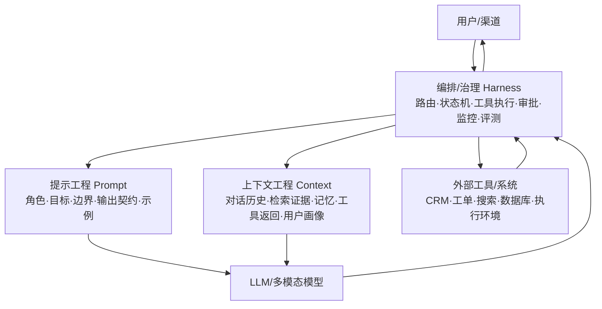
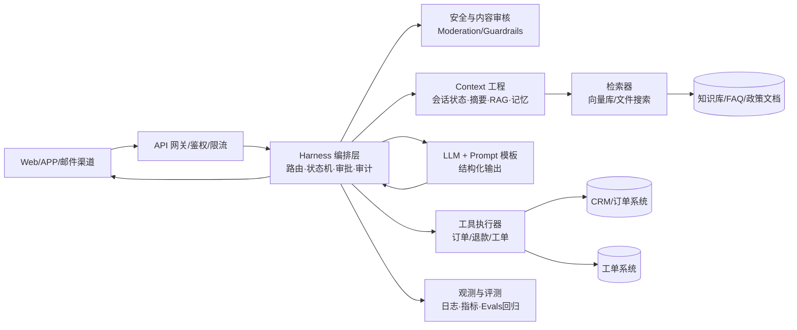
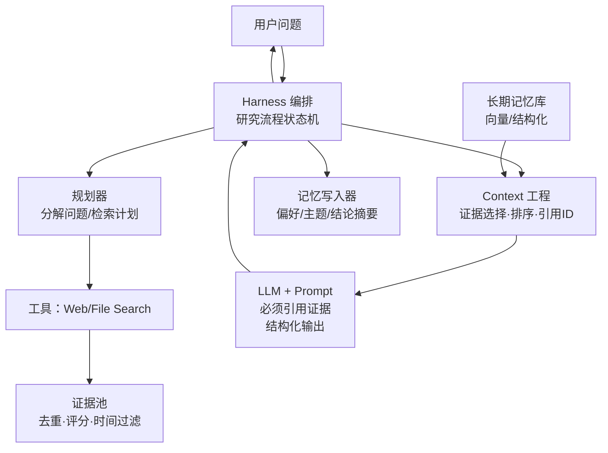
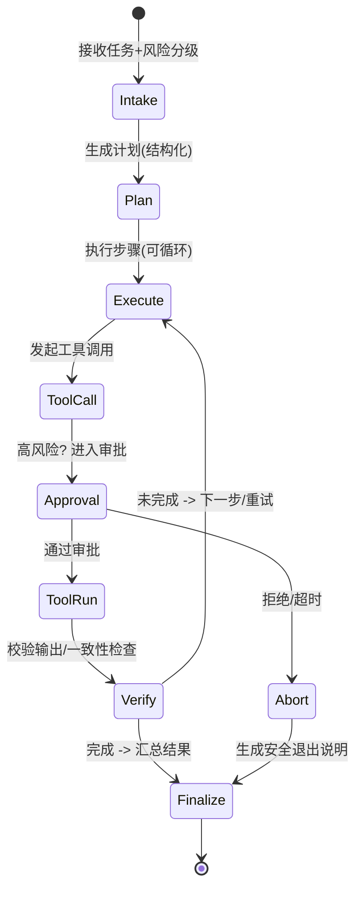

# 智能体三要素：提示工程、上下文工程与编排治理工程

## 执行摘要

智能体（Agent）在工程上不是“一个大 Prompt”，而是由三类互相制约的工程构件共同决定可靠性：**提示工程（Prompt Engineering）**负责把“要做什么、如何做、输出要满足什么契约”写成可版本化的指令与模板；**上下文工程（Context Engineering）**负责把“模型此刻需要知道什么”以可控成本组装进上下文（对话历史、检索证据、记忆、工具返回等）；**编排/治理工程（Harness Engineering）**负责把“模型如何被安全地接入现实世界”落实为运行时控制流、工具执行、安全、监控、评测与审计。OpenAI 将提示作为 API 中可版本化复用的对象（prompt object）并与 evals 结合，反映了“提示≠一次性文本，而是可治理资产”的趋势。  

在实践中，许多“幻觉/跑偏/不稳定”并非单纯提示写得不好，而是来自**上下文供应链**（检索噪声、长上下文“中间遗失”、记忆污染）与**编排缺失**（工具无权限边界、无审批闸门、无回滚与评测）。长上下文并不等于“模型会用好上下文”：相关研究显示，关键信息位于长输入“中间位置”时性能显著下降。  

安全与合规层面，OWASP 明确指出提示注入（Prompt Injection）源于“自然语言指令与数据混在一起被模型处理、缺乏清晰隔离”的常见设计；因此必须用治理与编排手段做隔离、最小权限、校验与人类在环。  

### 阅读导航

| 如果你最关心 | 建议先看 |
|---|---|
| 三要素分别负责什么 | 三要素框架与工程边界 |
| 工程组件、指标与工具栈 | 技术栈、指标与协同机制 |
| 常见失败模式与治理办法 | 风险与反模式及缓解策略 |
| 如何从 0 到 1 设计智能体 | 设计模式与实施清单 |
| 具体场景怎么落地 | 三个端到端示例 |

---

## 三要素框架与工程边界

### 三要素的工程化定义

- **提示工程（Prompt Engineering）**：围绕模型输入中的“指令层（Instruction Layer）”做工程化设计，使模型在给定任务域内稳定遵循目标、边界与输出契约。OpenAI 将 Prompting 定义为向模型提供输入、并强调输出质量高度依赖你如何提示；同时提供可版本化的 prompt 对象以便复用与评测。
- **上下文工程（Context Engineering）**：围绕“事实层（Facts/Evidence Layer）与状态层（State Layer）”做供给链设计：把对话历史、检索证据、用户档案、短期/长期记忆、工具返回等信息，以**可审计、可压缩、可预算**的方式装配进上下文，并持续对抗上下文窗口限制与信息位置偏置。OpenAI 在 Agents SDK 的会话记忆示例中明确：Responses API 支持用 `previous_response_id` 链接历史，但“自动记忆管理”并不免费，需要上层机制（如 Agents SDK Session Memory）来管理上下文。
- **编排/治理工程（Harness Engineering）**：围绕“运行时（Runtime Harness）”做系统工程：将模型置于明确的控制流（路由、计划-执行循环、重试、超时）、工具调用（权限、参数校验、幂等、审批/拒绝）、安全策略（内容审核、注入防护、人类在环）、可观测性（日志、追踪、指标）、评测与版本治理（prompt/model/tool 变更回归）之中。LangGraph 将其定位为面向 agent 编排的底层能力（durable execution、streaming、human-in-the-loop）。

### 目标边界：三件事分别“保证什么”

- **提示工程**更像**“契约与规范（Contract）”**：把任务目标、约束条件、输出结构（如 JSON schema）写清，使模型“知道什么叫完成”。Structured Outputs 的目标就是把这种契约从“靠提示与重试”升级成“由 schema 约束、训练增强的可靠输出”。
- **上下文工程**更像**“证据与状态供应链（Supply Chain）”**：保证模型拿到的是**正确、相关、最新、可追溯**的内容，并控制 token 成本与位置效应。RAG 研究提出将参数化记忆与外部非参数化记忆结合，通过检索增强生成以提升知识密集任务效果，并改善可更新性与可溯源性。
- **编排/治理工程**更像**“运行时安全壳与质量体系（Runtime + QA + Governance）”**：把智能体变成“可上线的软件系统”。NIST AI RMF 提出以 GOVERN / MAP / MEASURE / MANAGE 为核心的风险管理活动框架；其生成式 AI Profile 进一步给出在生成式 AI 场景下的风险与行动建议，强调贯穿生命周期的治理。

### 一页对照：三要素分别解决什么问题

| 要素 | 核心问题 | 主要产出 | 典型风险 |
|---|---|---|---|
| 提示工程 | 模型该如何完成任务 | 系统提示、输出契约、示例、工具策略 | 输出不稳定、格式失配、边界不清 |
| 上下文工程 | 模型此刻该知道什么 | 对话历史、证据片段、记忆、上下文预算 | 信息遗漏、证据噪声、记忆污染 |
| 编排/治理工程 | 模型如何安全接入真实系统 | 状态机、工具执行、安全闸门、监控评测 | 越权调用、无审批、无法回滚或审计 |

### 概念图：三层如何叠加成为一个可上线智能体



---

## 技术栈、指标与协同机制

下面用“职责/输入输出/典型技术/工具/指标”把三要素落到工程实体（组件、配置、测试与监控）上，并强调它们的依赖关系。

### 提示工程

**关键职责**  
把“任务意图”固化为可复用的提示资产，包括：角色与语气、目标、限制、工具使用规范、输出结构与示例。Anthropic 的提示工程文档把“清晰直接、给足上下文、有效示例（few-shot/multishot）”作为通用原则，并强调在动手前先建立成功标准与可测评方式。  

**输入 → 输出**  
- 输入：产品需求（用户意图、边界）、策略与合规要求、工具清单与 schema、评测样例。
- 输出：版本化 prompt（模板变量、模块化片段）、结构化输出 schema（JSON schema/函数调用参数）、提示回归测试集与评分规则。OpenAI 提供可版本化的 prompt 对象，并强调可用 evals 衡量不同版本提示效果。

**典型技术**（少但关键）  
1) **契约化提示（Contract-First Prompt）**：把输出格式写成 schema 并启用 Structured Outputs；可用于用户回复结构化、或工具调用参数严格化。  
2) **工具使用提示**：在系统提示中规定何时调用工具、如何解释工具结果；并用 function calling 把模型与外部系统连接。  
3) **示例驱动**：用少量高质量、覆盖边界条件的示例提升一致性（Anthropic 明确建议示例相关、多样、结构化标注）。  
4) **提示治理**：把提示当“代码/配置”管理版本、回滚、评测门禁。OpenAI 的 Prompt Management 与“Prompts in the API”体现该方向（版本化与模板变量）。  

**常用工具与平台**  
OpenAI Structured Outputs、Function Calling、Prompt objects + Evals；以及第三方的提示注册表/版本管理（如 MLflow Prompt Registry）。  

**核心指标（建议最少但可行动）**  
- 格式/契约指标：schema 通过率、字段缺失率、解析失败率（Structured Outputs 目标是提升 schema 遵循可靠性）。
- 任务指标：任务成功率、一次通过率（turn-level success）、拒答/转人工正确率。
- 成本指标：平均输入/输出 tokens、p95 延迟（提示越长越贵，上下文越大越慢，需要与上下文工程协同）。

### 上下文工程

**关键职责**  
把“模型需要知道的东西”变成可控的上下文包：既要足够信息支撑正确性，又要避免 token 爆炸、位置偏置、以及被注入污染。OpenAI 提供 Token Counting API，用于在发送请求前精确计算包含文本、文件、工具 schema 等在内的 tokens，并明确其用途包括适配上下文限制与成本预算。  

**输入 → 输出**  
- 输入：用户当前问题、对话历史、知识库/文档、工具返回、用户画像与记忆。
- 输出：最终上下文（messages/input payload）、检索到的证据片段（带元数据）、对话摘要/记忆写入、上下文预算报告（tokens/成本）。

**典型技术组件**  
1) **短期记忆（Session Memory）**：用 `previous_response_id` 或自管 messages；并在窗口逼近时做摘要/压缩。  
2) **长期记忆（Long-term Memory）**：将用户偏好、事实、任务进展存入外部存储并按需检索。MemGPT 提出通过分层记忆管理在有限上下文窗口下维持长期一致性与可演化性。  
3) **检索增强生成（RAG）**：把外部文档当“非参数化记忆”；RAG 论文强调其在知识密集任务上的优势与更具体/更事实的生成倾向。  
4) **托管检索与文件搜索**：OpenAI Cookbook 指出自建 RAG 往往涉及解析 PDF、切块、向量化、向量库检索等多步骤，File Search 作为托管工具可简化流程并在 Responses API 中使用。  
5) **长上下文风险控制**：研究显示长上下文下模型对信息位置敏感，“中间遗失（Lost in the Middle）”现象显著，因此需要重排、摘要、分段问答或检索式聚焦，而不是盲目塞满上下文。  
6) **缓存与 token 经济学**：Prompt Caching 支持不同保留策略（in-memory 与 extended），并给出保留时长与只持久化 KV 张量等实现细节；这意味着上下文工程应尽量稳定“可缓存前缀”，并把高频不变指令与背景放在可复用前缀中。  

**常用工具**  
OpenAI Token Counting API、File Search、Embeddings；向量库与重排器；以及可观测性工具（如 LlamaIndex 强调生产级 RAG/agent 需要可观测、可调试与可评测）。  

**核心指标**  
- 检索指标：Precision@k、Recall@k、命中率、重排增益；OpenAI 的 RAG 评测示例将评估拆成“检索评估”与“回答评估”。
- 生成指标：groundedness/faithfulness（回答是否受检索证据支持）、引用覆盖率、引用准确率。
- 上下文与成本指标：输入 tokens、上下文压缩率、缓存命中率、p95 延迟与成本。Prompt caching 的保留策略与 24h 上限使“缓存命中率”成为可直接优化的指标。

### 编排/治理工程

**关键职责**  
把“按语言推理的模型”封装为“可控的软件系统”：路由、计划-执行循环、工具调用、审批门禁、异常处理、可观测、评测、版本门禁、安全与合规。LangGraph 明确面向 agent 编排能力（durable execution、streaming、human-in-the-loop）。  

**输入 → 输出**  
- 输入：用户请求、上下文包、工具调用候选与权限策略、组织合规要求。
- 输出：最终响应、工具执行记录、审计日志、评测结果、告警与转人工事件。

**典型技术与机制**  
1) **状态机/图编排**：将多步流程显式建模（节点=步骤、边=条件跳转/循环），便于重试、回滚与人类审批。  
2) **计划-执行循环（Planning Loop）**：Semantic Kernel 的 planning 文档用“模型迭代调用函数、检查结果、再决定下一步”描述了典型反馈回路。  
3) **工具安全壳**：function calling 用 JSON schema 定义工具接口；配合 Structured Outputs 提升工具参数可靠性。  
4) **工具规模治理（tool surface）**：OpenAI Tool Search 支持延迟加载工具 schema，并建议用 namespace/MCP server 分组、每个 namespace 控制在较少函数数量以节省 tokens；且工具被发现后会注入到上下文末尾，意味着需要与上下文预算一起设计。  
5) **审批与人类在环**：OpenAI Agents SDK 暴露工具审批函数类型（如 Shell/ApplyPatch needs_approval / on_approval），并说明当需要审批时运行会被中断，必须 approve/reject 才能继续。  
6) **安全与红队**：OpenAI Safety best practices 建议使用 Moderation API、红队测试（包括提示注入 “ignore previous instructions” 等）、以及人类监督。  
7) **注入与越权防护**：OWASP 的 Prompt Injection Prevention Cheat Sheet 将提示注入定义为通过注入恶意输入操纵模型行为，并指出其根源在于指令与数据混合处理；因此编排层必须做数据隔离、最小权限、以及工具调用校验。  
8) **日志、审计与数据治理**：OpenAI “Your data”说明 Zero Data Retention/Modified Abuse Monitoring 等控制，以及 Responses API 默认应用状态保留与 `store` 行为变化；企业场景还有 Compliance Platform，日志保留 30 天且建议自行持续下载以满足更长保留。  

**治理参考框架（建议用于制度化）**  
NIST AI RMF（GOVERN/MAP/MEASURE/MANAGE）与生成式 AI Profile，为“如何把风险管理活动嵌入生命周期”提供语言与结构；ISO/IEC 42001 提供组织级 AI 管理体系（AIMS）要求与持续改进机制。  
若面向欧盟市场，还应关注 EU AI Act 的生效与分阶段适用：法规在刊登后第 20 天生效，但整体适用起点为 2026-08-02，且部分章节更早适用（如第 I、II 章自 2025-02-02 起）。  

**核心指标**  
- 系统可靠性：端到端任务成功率、工具成功率、重试次数、超时率、p95/p99 延迟。
- 安全：提示注入成功率（越权/泄露/误调用工具）、违规内容率（输入/输出）、误拦截率。OpenAI 将“红队”作为提升对抗性输入鲁棒性的推荐实践。
- 治理：变更回归通过率（prompt/model/tool 变更）、审计日志完整率、数据保留与访问控制合规性。

---

## 风险与反模式及缓解策略

这一节用“问题→根因→缓解”总结三要素最常见的失败模式。重点是：**很多“看起来是提示问题”的故障，实际上是上下文或编排问题**。

### 提示工程常见坑

**反模式：把一切需求塞进一个超长系统提示**  
- 根因：缺少模块化与版本治理；难以定位改动影响面；也会推高 token 成本，降低缓存收益。OpenAI 建议使用可版本化 prompt object 并结合 evals 做对比。
- 缓解：将提示拆成可组合模块（角色/约束/输出契约/工具策略/示例），通过 prompt 版本 + eval 回归门禁发布。

**反模式：只靠自然语言要求“输出 JSON”，不上 schema**  
- 根因：提示无法保证严格遵循结构。Structured Outputs 的设计目标正是将这种“靠提示与重试”的脆弱性替换为 schema 约束与训练增强。
- 缓解：工具参数用 function calling + strict schema；用户输出用 `json_schema` response format；同时度量 schema 通过率。

### 上下文工程常见坑

**反模式：把所有对话历史原封不动地追加**  
- 根因：上下文窗口有限且每轮增长；还会引入“历史噪声”与注入污染。OpenAI Guardrails 明确建议：多轮对话中应在 guardrails 通过后再把消息加入历史，避免被拦截/恶意输入污染上下文。
- 缓解：使用 token 预算 + 滚动窗口 + 摘要；并把“不可控外部内容”与“高优先级系统指令”隔离。

**反模式：迷信“更大上下文窗口=更高准确率”**  
- 根因：长上下文存在位置偏置。Lost in the Middle 研究表明：当相关信息出现在长输入中间时性能显著下降，常在开头或结尾最好。
- 缓解：检索式聚焦（RAG）、把关键证据放在上下文末端附近、分段问答、或“先检索再生成”的硬约束。

**反模式：RAG 只做“相似度 top-k”，不做评测与证据约束**  
- 根因：检索噪声与幻觉未被度量；缺少“回答必须引用证据”的提示契约。OpenAI 的 RAG 评测示例明确拆分检索评估与回答评估。
- 缓解：建立 question-context 数据集；度量检索相关性与回答质量；强制回答引用检索片段并做一致性检查。

### 编排/治理工程常见坑

**反模式：让模型直接“连到后台动作”，没有权限边界与审批**  
- 根因：工具调用具备真实副作用，提示注入/越狱会造成越权与数据泄露。OWASP 指出提示注入利用“指令与数据混杂处理”的设计缺陷；OpenAI 也在安全最佳实践中强调红队与监督。
- 缓解：最小权限工具集、参数校验与幂等、关键动作加审批闸门（Agents SDK 支持 needs_approval/on_approval 并可中断运行等待 approve/reject）。

**反模式：没有评测就上线，只靠“感觉不错”**  
- 根因：模型、提示、工具、知识库都在变；缺少回归基线会导致线上漂移。OpenAI Evals 提供评测框架与自定义 eval 能力，并强调高质量 eval 的重要性。
- 缓解：将 eval 作为发布门禁：prompt 版本、模型版本、检索策略与工具变更都必须跑回归；线上做采样审计与主动告警。

**反模式：日志与数据治理缺失**  
- 根因：无法定位事故、无法满足审计与合规。OpenAI “Your data”说明数据保留控制与 `store` 行为；企业还有 Compliance Platform，日志保留 30 天并建议自行持续下载。
- 缓解：分级日志（敏感字段脱敏）、可追踪 request-id、关键动作审计、保留策略与 DLP/SIEM 集成。

---

## 设计模式与实施清单

本节给出可复用的**设计模式**与“从 0 到 1”的**步骤清单**，覆盖单轮提示、多轮上下文、记忆、工具、编排、监控、安全、治理与评估。为减少冗余，把清单按工程生命周期组织。

### 设计模式库

**提示工程模式**  
- **模块化提示（Instruction Modules）**：将系统提示拆为：角色/目标、边界与拒答、工具策略、输出契约、示例。用 prompt object 做版本治理。
- **契约优先（Schema First）**：工具调用与关键输出用 Structured Outputs/JSON schema；把“可解析”从软约束变硬约束。
- **证据约束回答（Grounded Answer Contract）**：要求回答必须引用检索片段或工具返回，并声明不确定性与下一步检索。与 RAG 评测体系配套。

**上下文工程模式**  
- **三段式上下文（Working set / Summary / Memory）**：保留最近 N 轮原文（working set）+ 历史摘要（summary）+ 可检索长期记忆（memory/RAG）。与 token counting API 组合形成预算系统。
- **检索先行（Retrieve-then-Read）**：不把大文档直接塞上下文，而是先检索相关片段；避免 Lost-in-the-Middle。
- **可缓存前缀（Cacheable Prefix）**：把稳定不变的大段背景放在提示前缀，利用 prompt caching；并关注 extended retention 的 24h 上限与 KV 持久化机制。
- **工具面延迟加载（Deferred Tool Surface）**：工具 schema 很大时用 tool search + namespace/MCP server；减少上下文占用。

**编排/治理模式**  
- **路由器 + 专家子代理（Router + Specialists）**：先做意图分类与风险分级，再分配到“FAQ/RAG/工单/退款”等专门流；降低单一提示复杂度。
- **状态机编排（State Machine Orchestration）**：把多步任务显式建模，支持循环、重试、分支与人工审批；LangGraph 将 durable execution、human-in-the-loop 作为核心。
- **工具调用安全壳（Tool Safety Wrapper）**：对每个工具做：权限、输入校验、速率限制、幂等键、输出一致性检查；关键动作加审批（Agents SDK 的 needs_approval/on_approval）。
- **评测门禁（Eval Gate）**：prompt/model/tool/检索策略变更必须过离线回归；OpenAI Evals 提供框架与私有 eval。

### 从零构建智能体的实现清单

**需求与成功标准**  
1) 定义用户任务、失败代价、允许的错误类型（答错 vs 不答 vs 转人工）。  
2) 把成功标准变成可测样例集（Anthropic 建议先明确成功标准与可测评方法）。  
3) 进行风险分级：是否涉及敏感数据、财务/法律/医疗、是否有真实副作用工具；映射到治理要求（NIST AI RMF 的 GOVERN/MAP/MEASURE/MANAGE 可作为组织语言）。  

**单轮提示（Single-turn Prompt）**  
1) 设计模块化系统提示：角色/目标/边界/输出 schema/工具策略。  
2) 对关键输出启用 Structured Outputs（用户输出或工具参数）。  
3) 建立 prompt 版本：用 prompt object 或外部 prompt registry；明确“线上引用最新版本还是 pin 到某版本”。  

**多轮上下文管理（Multi-turn Context）**  
1) 建立 token 预算器：在发送请求前用 Token Counting API 计算真实 token 占用（包含 tools/files）。  
2) 定义上下文拼装顺序：高优先级指令（system）> 当前用户意图 > 关键证据（RAG/tool output）> 最近对话 > 历史摘要 > 低优先背景。  
3) 强制“guardrails 通过后再落库历史”，避免被拦截/恶意内容污染对话状态。  
4) 针对长上下文：避免把关键信息放在中间；必要时重排到末端或改为检索聚焦。  

**记忆（Memory）**  
1) 区分：可变会话状态（短期）vs 跨会话事实（长期）。  
2) 长期记忆写入策略：只写“稳定事实/偏好/授权信息”，并记录来源与时间。  
3) 检索策略：按用户/任务/时间过滤；回答时强制引用记忆来源或声明不确定。MemGPT 的分层记忆思想可作为参考。  

**工具使用（Tool Use）**  
1) 工具接口用 function calling + JSON schema；敏感字段最小化。  
2) 工具面太大：用 tool search + namespace/MCP server 延迟加载；保持命名空间简洁。  
3) 工具安全：参数校验、幂等、速率限制、审计日志；高风险动作加审批。  

**编排与可靠性（Orchestration & Reliability）**  
1) 用状态机实现：计划→执行→校验→重试/升级→完成；支持超时与中断恢复（durable execution）。  
2) 错误处理：工具失败重试策略、降级路径（只读模式/转人工/请求更多信息）。  
3) 输出校验：schema 校验、事实一致性校验（回答是否与检索证据一致）。  

**监控、安全、治理与评估（Monitoring, Safety, Governance, Evaluation）**  
1) 安全：接入 Moderation API；做红队测试（提示注入、越权工具调用等）；关键路径人类监督。  
2) 注入防护：视外部内容为不可信数据；对工具调用做语义一致性检查与最小权限。OWASP 明确提示注入的根因与影响。  
3) 评测：用 OpenAI Evals 建立回归；RAG 用检索评估+回答评估拆分。  
4) 数据治理：定义数据保留与 `store` 策略；企业场景对接 Compliance/SIEM，注意日志保留窗口。  
5) 体系化治理：对齐 NIST AI RMF 与 ISO/IEC 42001（组织级 AIMS），并关注适用法律（如 EU AI Act 的分阶段适用）。  

---

## 端到端示例：客服机器人

> **场景目标**：面向客服场景，平衡回答准确性、工具调用安全性与转人工流程。

### 架构图



### 组件表（谁负责三要素中的哪一块）

| 组件 | 归属要素 | 主要职责 | 关键输入 | 关键输出 |
|---|---|---|---|---|
| Prompt 模板（系统提示+示例+输出契约） | 提示工程 | 定义客服边界、语气、升级规则、引用规则；强制结构化输出 | 品牌策略、合规要求、工具清单 | 版本化 Prompt、schema |
| 上下文拼装器 | 上下文工程 | 滚动窗口+摘要；注入防护；拼装检索证据 | 对话历史、用户资料、检索片段 | messages/input payload |
| RAG 检索器 | 上下文工程 | 召回相关政策/FAQ/订单条款 | 用户问题、向量索引 | top-k 证据+元数据 |
| 工具层（订单查询/退款/创建工单） | 编排/治理工程 | function calling + 参数校验 + 幂等 + 权限 | 工具请求（schema） | 结构化工具结果 |
| 编排状态机 | 编排/治理工程 | 路由、重试、升级、审批、人类在环 | 用户请求、风险信号 | 最终答复/转人工 |
| 安全层（Moderation/Guardrails） | 编排/治理工程 | 输入/输出审核；阻断 prompt injection 迹象 | 原始输入、候选输出 | allow/block/transform |
| 观测与评测 | 编排/治理工程 | 在线监控 + 离线回归 eval | 日志、标注集 | 指标、告警、回归结果 |

> 注：安全与审核建议参考 OpenAI Safety best practices（moderation、red-teaming、人类监督）。  

### Prompt 模板示例（模块化 + 契约化）

**系统提示（示例，建议作为 prompt object 的 v1）**  
变量占位：`{{brand_tone}}`、`{{supported_topics}}`、`{{escalation_policy}}`

```text
角色：你是公司客服助理，语气为 {{brand_tone}}。
边界：只能回答 {{supported_topics}}；遇到不确定、需要访问权限或涉及退款/隐私时必须走工具或升级。
证据：如果回答涉及政策/条款，必须引用检索到的段落 ID（来自 RAG）。
工具：
- lookup_order(order_id, customer_id)：只读查询订单
- create_ticket(category, summary, urgency)：创建工单
- request_refund(order_id, reason)：仅在满足退款规则且获得用户确认后调用；高风险需审批
输出契约（JSON）：
- reply：给用户的最终回答（中文）
- action："none" | "tool_call" | "handoff"
- citations：引用的证据段落 ID 列表
- needs_human：boolean
- safety_notes：若触发审核/风险，说明原因与处置
```

**说明**：将输出 JSON schema 用 Structured Outputs/`json_schema` 强制执行；OpenAI 建议在可能时优先使用 Structured Outputs 而非旧 JSON mode。  

### 关键配置参数（建议基线）

**模型与采样**
- `model`: 选择支持 function calling 与 structured outputs 的模型；Structured Outputs 从 GPT-4o 起支持。  
- `temperature`: 0.1–0.3（客服偏确定性）  
- `max_output_tokens`: 依据渠道限制（如 800–1500）  

**检索与上下文**
- `retrieval_top_k`: 3–6（先小后大，用评测调）  
- `chunk_size_tokens`: 300–600（视文档结构）  
- `context_budget_tokens`: 例如 12k–24k，并在发送前用 Token Counting API 计算真实占用。  
- `history_window_turns`: 最近 6–12 轮原文 + 历史摘要  

**工具治理**
- 高风险工具（退款/改地址）`needs_approval=true`，让运行在审批处中断等待 approve/reject（Agents SDK 支持）。  

### 测试与评估计划（离线回归 + 安全红队）

1) **离线功能集**：常见问题（物流、发票、退换）、边界问题（政策外）、多轮澄清。  
2) **RAG 评估**：分开做检索评估与回答评估（OpenAI 示例强调这两部分）。  
3) **结构化输出测试**：schema 通过率、字段缺失率。  
4) **工具调用测试**：参数校验、幂等、超时重试、审批流程是否正确中断并可恢复。  
5) **安全红队**：提示注入、诱导泄露、越权退款；参考 OWASP 提示注入定义与影响。  

- 可用工具：OpenAI Evals（自定义 eval + 私有数据集）。

### 部署与监控清单

- 上线策略：灰度发布（小流量 → 全量），每次 prompt/tool/检索策略变更必须跑回归。  
- 监控：p50/p95 延迟、成本/会话、转人工率、工具失败率、退款审批触发率。  
- 安全：输入/输出 moderation 命中率；注入检测告警；异常工具调用告警（工具与用户意图不一致）。  
- 审计与数据治理：记录关键动作与审批证据，按组织的数据保留策略配置（注意 `store` 与 Zero Data Retention 行为差异）。  

---

## 端到端示例：检索型研究助手（RAG + 记忆 + 引用）

> **场景目标**：用户提出研究问题，系统自动检索（web/file/内部库）、合成带引用的分析报告，并记住用户偏好与研究主题进展。

### 架构图



### 组件表

| 组件 | 归属要素 | 说明 |
|---|---|---|
| 研究写作 Prompt（引用规则、证据优先） | 提示工程 | 要求“先证据后结论”，并输出引用映射表 |
| 证据池（Evidence store） | 上下文工程 | 收集搜索结果/文件片段，做去重、可信度评分、时效过滤 |
| 记忆系统（偏好/主题/术语表） | 上下文工程 | 跨会话记忆：研究主题、用户偏好格式、常用来源 |
| 状态机编排（plan→search→synthesize→verify） | 编排/治理工程 | 循环检索、补证据、校验引用一致性；可中断与恢复（durable execution 理念） |
| 评测回归（引用准确率/事实性） | 编排/治理工程 | 以 Evals/自建测试集衡量稳定性  |

### Prompt/模板（强调“可验证的研究”）

**系统提示核心片段**  
```text
任务：生成“基于证据的研究综述”。
规则：
1. 每个关键结论必须附带至少 1 条证据引用。
2. 如果证据不足，必须显式写“证据不足”并提出需要继续检索的问题。
3. 禁止把未检索到的事实当作确定事实。
输出结构（JSON）：
- outline
- claims[]
- citations[]
- open_questions[]
```

**为什么这样设计**：  
- RAG 的核心价值在于让生成受外部证据约束（RAG 论文强调将非参数化记忆与生成结合以改善知识密集任务表现与可更新性）。  
- 同时必须预防“长上下文中间遗失”，因此证据选择应聚焦少量高相关片段并在上下文中靠近生成阶段放置。  

### 配置参数（研究助手建议）

**检索**
- Web 搜索：允许域名白名单（如 arxiv、期刊官网）；控制 `recency` 与最大来源数。  
- File Search：用于企业内部资料（OpenAI Cookbook 指出 File Search 可作为托管检索工具简化 RAG 工作流）。  

**上下文**
- `evidence_top_k`: 8–15（证据池→最终上下文再筛到 4–8）  
- `context_budget_tokens`: 24k–64k（视模型），并用 Token Counting API 动态裁剪。  
- `summary_strategy`: “研究过程摘要 + 结论列表 + 待验证点”  

**记忆**
- 只写入稳定偏好（如引用格式、常用数据库）；对“临时结论”以草稿标记，避免污染长期记忆。MemGPT 的分层记忆思想提醒我们要管理不同记忆层级以适配有限上下文。  

### 测试与评估计划

1) **引用准确率测试**：随机抽样 claims，检查引用是否支持 claim（可用 LLM-as-judge + 人工复核）。  
2) **检索质量测试**：Precision@k/Recall@k；对关键问题构造“应命中文档”。  
3) **长上下文鲁棒性**：把关键证据位置随机化，观察是否出现 Lost-in-the-Middle 弱化。  
4) **提示回归**：用 OpenAI Evals 固化数据集与评分，模型或提示升级时必须通过。  

### 部署与监控清单

- 指标：回答“证据覆盖率”、引用数、纠错率、二次检索触发率、成本/报告。  
- 安全：防止检索结果携带恶意注入指令（外部内容视为不可信数据；对工具调用做一致性校验）。OWASP 强调注入根源在于指令与数据混合处理。  
- 合规：若处理企业数据，参照 OpenAI 的数据控制与企业隐私承诺配置保留策略。  

---

## 端到端示例：自主任务执行器（工具链 + 审批 + 可恢复执行）

> **场景目标**：用户给出一个高层任务（如“整理本周销售数据并生成汇报邮件草稿”），智能体能拆解任务、调用工具（数据查询、代码执行、文档生成、邮件草稿），但对任何高风险动作实施审批、审计、可回滚。

### 架构图（状态机 + 人类审批闸门）



### 组件表

| 组件 | 归属要素 | 关键实现点 |
|---|---|---|
| Planner Prompt（计划输出 schema） | 提示工程 | 计划必须结构化（步骤、依赖、所需工具、风险级别） |
| Executor Prompt（执行/校验/总结） | 提示工程 | 强制“工具返回→校验→下一步”循环（类似 planning feedback loop） |
| 会话状态与工作记忆 | 上下文工程 | 保存“当前计划、已完成步骤、失败原因、下一步”；必要时摘要压缩 |
| 工具层（代码执行/数据库/文件/邮件草稿） | 编排/治理工程 | function calling + 权限；可用 hosted code interpreter/sandbox；关键动作审批 |
| 审批系统（human-in-the-loop） | 编排/治理工程 | needs_approval/on_approval；中断运行等待批准  |
| 观测/审计/评测 | 编排/治理工程 | 记录每次工具调用、审批决策、输出校验结果；回归评测 |

### Prompt/模板示例

**Planner（结构化输出）**  
```text
输出 JSON schema：
- steps[]：每步包含 goal、tool、inputs、risk_level、rollback
- assumptions[]
- needs_user_confirmation[]
- done_definition：什么算完成
```

**Executor（循环执行）**  
```text
规则：
1. 每次只执行 1–2 个步骤。
2. 调用工具前先输出“将调用的工具、参数摘要、风险级别”。
3. 若风险级别 >= High，必须请求审批并等待。
4. 工具返回后做一致性校验，再进入下一步。
```

**依据**：  
- OpenAI function calling 用 JSON schema 将模型与外部动作连接；适合把“语言推理”落成“可执行调用”。  
- Agents SDK 支持对 shell/apply_patch 等工具设置 needs_approval，并在需要时中断运行等待 approve/reject。  

### 配置参数（自主执行器建议更严格）

- `max_steps`: 10–30（防止无限循环）  
- `tool_timeout_s`: 每个工具 10–60s  
- `retry_policy`: 工具失败最多 2 次；再失败则降级/转人工  
- `approval_required_tools`: 写操作、外部发送（邮件/工单提交）、资金相关操作  
- `tool_surface`: 工具尽量小；必要时用 tool search 延迟加载大工具集合。  
- `logging_level`: 记录计划、工具参数摘要、审批与回滚点；注意敏感信息脱敏（结合企业数据控制策略）。  

### 测试与评估计划

1) **工具单测**：每个工具 wrapper 的参数校验、权限检查、幂等键与超时。  
2) **端到端任务集**：常见任务（报表生成、数据清洗、文档写作）+ 异常任务（缺权限、数据缺失）。  
3) **审批流程测试**：高风险动作必触发审批；拒绝后必须安全退出并说明。  
4) **注入与越权红队**：构造外部文本（邮件/PDF/网页片段）企图诱导执行危险工具；OWASP 将提示注入视为 LLM 应用关键漏洞。  
5) **回归评测**：用 OpenAI Evals 固化关键任务成功率与安全指标，模型/提示升级必须通过。  

### 部署与监控清单

- 运行保障：支持中断恢复（durable execution 思路），记录每步状态与回滚点。  
- 监控：工具失败率、审批等待时间、循环次数、成本/任务、任务完成率。  
- 安全：危险工具调用告警、异常参数告警、注入检测命中、违规内容命中（Moderation）。  
- 合规与审计：企业场景可对接审计/合规日志平台（例如 Compliance Platform 提供日志与 30 天游标保留窗口提示）。  

---

### 结论性要点（把三要素落到“设计时该注意什么”）

1) **提示工程要“契约化+版本化”**：系统提示写清目标/边界/工具策略/输出 schema，并把它当配置资产做版本、评测、回滚。  
2) **上下文工程要“证据化+预算化”**：用检索与记忆把事实外置，解决知识更新与溯源；用 token counting、摘要与缓存稳定前缀控制成本；警惕长上下文位置偏置。  
3) **编排/治理工程要“最小权限+可恢复+可审计+可评测”**：状态机编排、多层 guardrails、审批闸门、日志审计与持续红队；用 NIST/ISO 等框架把这些活动制度化。
