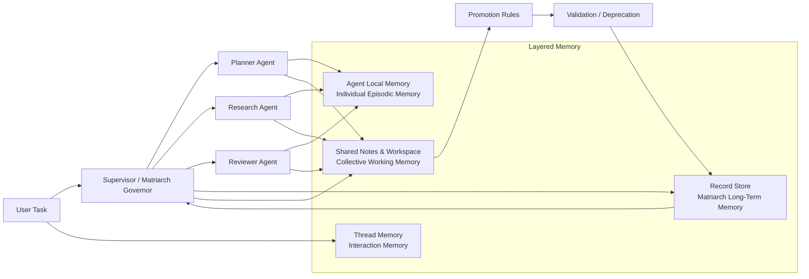

# 族长治理式群体记忆框架

## 1. 正式命名

建议将当前这套机制命名为：

**族长治理式群体记忆框架**

对应英文可写为：

**Matriarch-Governed Collective Memory Framework**

如果需要更偏论文标题式的表达，可以使用：

- **A Matriarch-Governed Collective Memory Framework for Multi-Agent Systems**
- **Matriarch Memory Governance for Supervisor-Centric Multi-Agent Collaboration**
- **Elephant-Inspired Collective Memory Governance in Multi-Agent Architectures**

建议在正文中统一采用以下缩写：

- 中文简称：`族长记忆框架`
- 英文简称：`MGCM`
  解释：`Matriarch-Governed Collective Memory`

其中，“族长治理”强调这不是普通共享缓存，也不是无约束的公共黑板，而是一种带有晋升、复核、降级和接班机制的记忆治理结构。

## 2. 核心定义

### 2.1 定义

族长治理式群体记忆框架是指一种面向多智能体系统的分层记忆架构。该架构以监督者型智能体作为“族长治理者”，将个体经验、群体工作记忆和长期群体知识区分存储，并通过规则化的晋升、验证、降级和继承机制，实现跨任务、跨轮次、跨代理的稳定知识保留与协作复用。

### 2.2 设计动机

传统多智能体记忆通常存在三个问题：

- 个体经验和群体知识混写，导致噪声不断累积
- 共享记忆缺少治理，导致错误经验容易被长期继承
- 协调者一旦切换或重启，系统难以恢复长期协作经验

大象群体的协作记忆机制提供了一个可迁移的启发：

- 关键生存知识并非平均分布在所有成员中
- 群体长期知识由“族长”承担主导组织与传承责任
- 年轻个体通过参与任务和共享线索逐步学习群体知识
- 族长失效后，群体是否能延续知识，取决于是否存在持久化和接班机制

因此，MGCM 的研究目标不是“让每个 agent 都更会记”，而是“让整个 agent 群体更会保留、筛选和继承有价值的协作知识”。

## 3. 理论抽象

### 3.1 四层记忆模型

MGCM 将多智能体记忆划分为四个功能层：

1. **交互层记忆（Interaction Memory）**
   作用：保存当前轮次的消息与上下文。
   在 `agentorch` 中对应 `thread_messages`。

2. **个体经验层（Individual Episodic Memory）**
   作用：保存单个 agent 在执行中的局部观察、失败经验、偏好与判断。
   在 `agentorch` 中对应 `agent_local_memory`。

3. **群体工作记忆层（Collective Working Memory）**
   作用：保存当前任务期间由多个 agent 共享的候选事实、阶段结论和共享线索。
   在 `agentorch` 中对应 `shared_notes` 与 `workspace_records`。

4. **族长长期记忆层（Matriarch Long-Term Memory）**
   作用：保存经族长审核后被认定为稳定、可复用、可继承的群体知识。
   在 `agentorch` 中对应扩展后的 `record_store` 中的 `matriarch` 记录。

这四层的区别不是“数据放在哪”，而是“知识处于什么治理阶段”。

### 3.2 三种记忆角色

在 MGCM 中，每条记忆都具有明确的治理角色：

- `individual`
  含义：仅代表某个 agent 的局部经验，不自动成为群体知识

- `shared`
  含义：已经进入群体工作空间，但仍处于待验证阶段

- `matriarch`
  含义：已经通过族长治理流程，被提升为长期群体知识

因此，MGCM 的关键不是简单增加一张共享表，而是定义知识从 `individual -> shared -> matriarch` 的演化路径。

### 3.3 治理状态机

为保证长期记忆质量，MGCM 为每条群体知识定义治理状态：

- `candidate`
  尚未完成稳定性验证

- `validated`
  已通过族长审核，并在任务中被复用或确认

- `deprecated`
  已经失效、过期或被更优知识替代

这使系统具备了类似“知识生命周期管理”的能力，而非一次写入、永久有效。

## 4. 机制流程

### 4.1 经验晋升机制

MGCM 的核心机制是**记忆晋升**。其流程如下：

1. specialist agent 在执行中形成局部观察，写入个体经验层
2. 若某条观察具有潜在复用价值，则作为候选知识写入群体工作记忆层
3. supervisor 在聚合阶段对候选知识进行归并与审核
4. 满足晋升条件的候选知识被提升为 matriarch memory
5. 后续任务再次命中该知识时，可触发复核并提高 `reuse_count`

建议在论文中将此流程表述为：

**Experience Promotion Pipeline**

或者中文表述为：

**经验晋升流水线**

### 4.2 复核与降级机制

MGCM 不假设群体知识天然正确，因此要求：

- 被再次命中的长期群体知识应被复核
- 复核成功时更新验证时间与复用计数
- 被证伪或失效的知识应标记为 `deprecated`

这一步可称为：

- **Collective Memory Validation**
- **Collective Memory Deprecation**

### 4.3 接班与继承机制

在论文表达上，MGCM 的一个亮点是“族长不是唯一存储者，而是唯一治理者”。

具体来说：

- 群体知识持久化保存在长期存储中
- supervisor 只是执行治理与注入的角色
- 当 supervisor 实例重建时，仍可从持久化记录中恢复群体知识

这一点可以表述为：

**Decoupled Governance and Persistent Inheritance**

中文可写为：

**治理角色与持久继承解耦**

这能突出你这套设计相比“单点主控记忆”的先进性，因为它避免了协调者重启即失忆的问题。

## 5. 在 agentorch 中的实现映射

### 5.1 角色映射

在当前 `agentorch` 实现中，MGCM 对应关系如下：

- `Supervisor`
  作为族长治理者，负责群体知识的检索、注入、晋升和复核

- `MemoryManager`
  作为统一记忆编排器，负责分层存储与治理接口

- `SharedNote`
  作为候选群体知识的临时承载对象

- `MemoryRecord` / `CollectiveMemoryRecord`
  作为长期群体知识的结构化表达

### 5.2 数据字段映射

当前实现中的关键治理字段包括：

- `memory_role`
- `confidence`
- `source_agents`
- `status`
- `last_validated_at`
- `reuse_count`
- `scope`

这些字段在论文中可统一称为：

**Collective Memory Governance Metadata**

中文可以写成：

**群体记忆治理元数据**

### 5.3 提示注入映射

群体知识在运行时不会混入普通对话摘要，而是作为独立上下文段落注入：

- `collective_memory_context`
- `collective_memory_evidence`
- `collective_memory_citations`

这意味着系统显式区分：

- 对话连续性所需的 thread memory
- 知识增强所需的 retrieved knowledge
- 协作继承所需的 collective memory

论文里可以将这种设计称为：

**Context Separation for Collaborative Memory Injection**

中文可写为：

**协作记忆注入的上下文分离机制**

## 6. 架构图说明

### 6.1 论文中的图名建议

你可以将架构图命名为：

- 图 X 族长治理式群体记忆框架总览
- Figure X. Overview of the Matriarch-Governed Collective Memory Framework

### 6.2 架构图分区建议

建议把图分成五个区域：

1. 用户任务输入区
2. Supervisor 治理与委派区
3. Specialist Agents 执行区
4. 分层记忆区
5. 记忆治理循环区

### 6.3 Mermaid 版本示意图

下面这张图可以直接放进 Markdown 文档，也可以作为你后续绘制正式论文图的草图。

### 6.4 图中文字解释

图中箭头建议解释为：

- `User Task -> Supervisor`
  表示用户请求首先进入族长治理节点

- `Matriarch Long-Term Memory -> Supervisor`
  表示 supervisor 在任务开始前检索群体长期知识

- `Supervisor -> Specialist Agents`
  表示族长根据当前任务进行委派，并携带相关群体知识上下文

- `Specialist Agents -> Shared Working Memory`
  表示个体经验先进入候选共享空间，而不是直接成为长期真知

- `Promotion Rules / Validation -> Matriarch Long-Term Memory`
  表示长期群体知识必须经过晋升与复核治理

## 7. 论文写作模板

### 7.1 一句话摘要版本

可以直接用于摘要或引言中的一句话：

> 我们提出了一种族长治理式群体记忆框架，通过监督者中心的记忆注入、候选经验晋升与长期知识复核机制，实现多智能体系统中稳定、可继承的协作记忆管理。

### 7.2 段落版定义

可以用于方法章节开头：

> 为解决多智能体系统中个体经验难以沉淀、共享知识缺少治理以及协调者失效后长期记忆难以继承的问题，本文提出族长治理式群体记忆框架（Matriarch-Governed Collective Memory, MGCM）。该框架受大象群体协作记忆机制启发，将系统记忆划分为交互记忆、个体经验记忆、群体工作记忆和族长长期记忆四层，并引入以 supervisor 为中心的记忆治理流程，使候选知识必须经过晋升、验证和生命周期管理后方可进入长期群体知识库。该设计将记忆的“存储”与“治理”解耦，从而在多智能体任务协作中实现可持续复用和可恢复继承。

### 7.3 方法章节小标题建议

建议方法部分采用以下小标题：

- 3.1 Elephant-Inspired Motivation
- 3.2 Matriarch-Governed Collective Memory
- 3.3 Layered Memory Roles and Governance States
- 3.4 Experience Promotion and Validation Pipeline
- 3.5 Collective Memory Injection and Persistent Inheritance

中文可对应：

- 3.1 大象协作记忆的生物启发
- 3.2 族长治理式群体记忆框架
- 3.3 分层记忆角色与治理状态
- 3.4 经验晋升与复核流水线
- 3.5 群体记忆注入与持久继承机制

## 8. 学术表达上的亮点

如果你要在答辩或论文中强调创新点，建议聚焦以下四点：

### 8.1 从“共享记忆”提升到“治理记忆”

很多系统只有共享黑板或共享缓存，而 MGCM 强调共享知识必须经过治理流程。

### 8.2 从“单 agent 记忆”转向“群体记忆生命周期”

MGCM 研究的是群体知识如何形成、验证、失效与继承，而不是单个 agent 如何扩大上下文窗口。

### 8.3 从“主控持有知识”转向“主控治理知识”

supervisor 不是唯一保存者，而是唯一默认治理者，这让系统具备接班能力。

### 8.4 从“上下文注入”转向“协作知识注入”

MGCM 强调注入的是经过治理的群体经验，而不是普通历史对话或检索结果。

## 9. 可直接引用的总结

最终可以用下面这段作为结尾式定义：

> 族长治理式群体记忆框架的本质，是将多智能体系统中的长期协作知识从“无约束共享信息”提升为“受治理的群体资产”。在这一框架下，知识并非由所有个体平权写入，也并非由主控节点独占保存，而是在个体观察、共享候选、族长审核、长期沉淀和持续复核之间形成一条可追踪、可继承、可修正的群体记忆演化链路。

